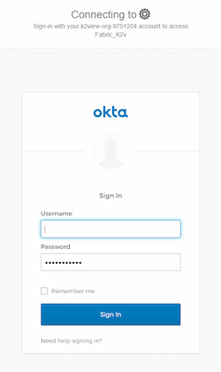
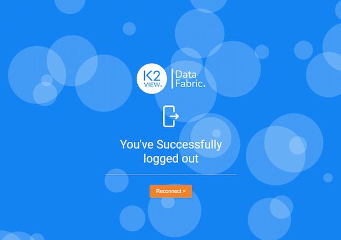

# Web Login

Access to the Fabric web framework and its apps is done via user credentials and permissions. 

## Login

If there is no active Fabric session, the user should provide his credentials that are verified by the relevant IAM authenticator.

#### Fabric and LDAP Authenticators 

#### SAML Authenticator

User is redirected to the configured SAML IDP and, from its login page, enters his credentials. For example at Okta IDP:

While preparing the authentication request and initiating the interaction with the IDP, a loading spinner might appear, indicating to the user that the process is proceeding.

## Logout

#### Fabric and LDAP Authenticators

Upon logout, the Fabric session is invalidated and the user is directed back to the login page, where he can type his credentials and login back to the web framework.

#### SAML Authenticator

Upon logout, the Fabric session is invalidated and the user is directed to a "logout" page, where he can decide whether to reconnect.

Clicking the reconnect button will activate a SAML authentication process. If the IDP verifies that its user is still valid, the user is returned to the Fabric web framework. If the IDP determines that the user is not valid, the user will be redirected to the IDP login page.

## Session timeout

Following some predefined idle time, the user's session in the Fabric web framework expires. If the user wishes to continue, he should renew the session. When trying to take any action after a session expiration, the user is notified via a popup alert that his session must be renewed.

When either Fabric or LDAP authenticators are active, the user will be redirected to the login page. There, he should re-enter his credentials. If the authenticator is SAML, the IDP session might be still valid, although the Fabric session has expired. As a result, the user can benefit from the SSO feature, that is, he will not be required to go through the login process again.

 

## User Details Panel

The User Details panel is located at the top right area of the web framework, next to the avatar icon.

To see the logout action and the connected user name, the user should click on the avatar icon. 

If the authenticator is Fabric, the "change passwords" action appears as well, otherwise it is hidden and disabled. The below image shows the open panel when using an external authenticator:

