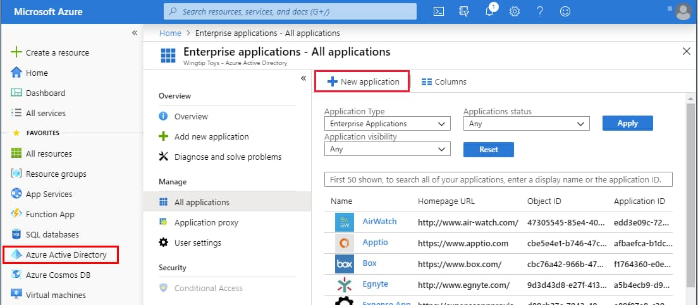
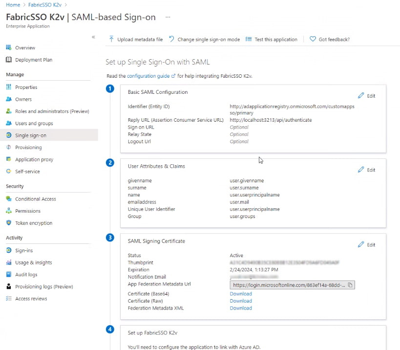
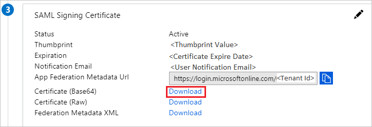
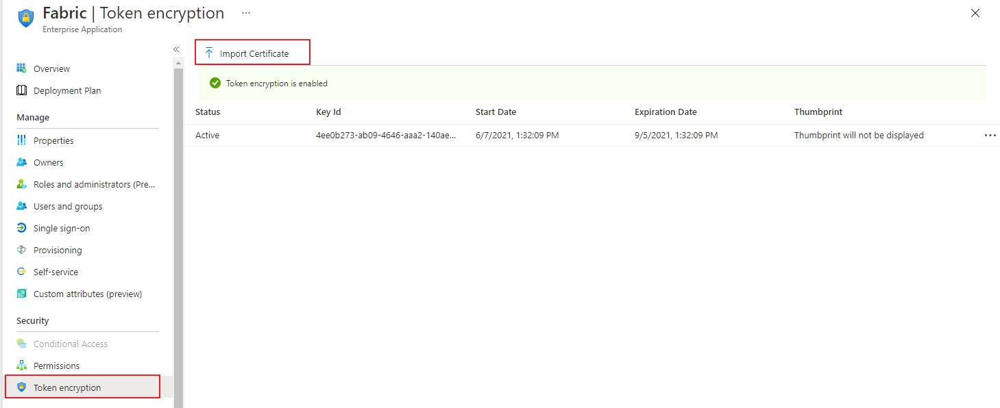
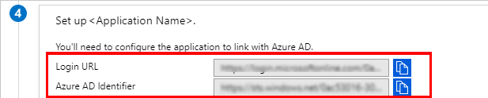

# Azure AD SAML Setup Guide

This article describes the setup and integration steps you should take in order to connect your Single-Sign-On account at Azure AD (Microsoft Azure Active Directory) to Fabric. This will grant you the benefits of an easy sign-in, along with authentication and authorization control via your admin tools.

You can read more about the guidelines at this link: [Azure AD](https://docs.microsoft.com/en-us/azure/active-directory/saas-apps/fabric-tutorial), as Fabric is a part of the Azure AD's app marketplace. 

### Prerequisite Requirements

- Admin access to Azure AD.
- Access to Fabric configuration settings. For more information about SAML configuration at Fabric, please see [here](/articles/26_fabric_security/13_user_IAM_configiration.md#saml-configuration).

## Configuration instructions: At Azure AD

1. In the [Azure portal](https://portal.azure.com/), on the left navigation panel, select **Azure Active Directory**.

2. In the **Azure Active Directory** pane, select **Enterprise applications**. The **All applications** pane opens.

  3. Select **New application**.

   <table>
   <tbody>
   <tr>
   	<td >
       
       </td>
   </tr>
   </tbody>
   </table>

3. In the **Add from the gallery** section, type **Fabric** in the search box.

4. Select **Fabric** from results panel and then add the app. Wait a few seconds while the app is added to your tenant.

5. On the **Fabric** application integration page, find the **Manage** section and select **single sign-on** to open the **Single sign-on** pane for editing.

6. Select **SAML** to open the SSO configuration page.  

7. Click to edit the various sections, similar to what is shown below (the app name in this example is "*FabricSSO K2v*"):

   <table>
   <tbody>
   <tr>
   	<td >
   	
   	</td>
   </tr>
   </tbody>
   </table>

8. Edit the **Basic SAML Configuration** section (1) - information should be taken to match the Fabric Configuration, as explained [here](/articles/26_fabric_security/13_user_IAM_configiration.md#saml-configuration).

   - **Entity ID**
   - **Reply URL** **(Assertion Consumer Service URL)** - the location where the SAML assertion is sent with a POST operation back to Fabric. Its format: `https://<HOSTNAME>:<PORT>/api/authenticate` (host name shall be the Fabric LB).

   <table>
   <tbody>
   <tr>
   	<td >
   	
   	</td>
   </tr>
   </tbody>
   </table>

9. Edit the **User Attributes & Claims** section (2) and verify that the groups are sent in a claim named "groups".

10. From the **SAML Signing Certificate** section (3), click **Download** to get the Azure IDP certificate key to be uploaded into Fabric, for signing the authentication requests.

  <table>
  <tbody>
  <tr>
  	<td >
  	
  	</td>
  </tr>
  </tbody>
  </table>

11. Upload the public key certificate used to encrypt the SAML assertion, as exported from Fabric. See more  [here](/articles/26_fabric_security/13_user_IAM_configiration.md#saml-configuration) at SAML Configuration > Preparations > Provide to the IDP. 

    <table>
    <tbody>
    <tr>
    	<td >
    	
    	</td>
    </tr>
    </tbody>
    </table>

12. From the 4th section - **Set up \<app-name>** (in our example "*FabricSSO K2v*") - copy the IDP parameters - **Login URL** and **Azure AD Identifier**, to be populated at the Fabric SAML configuration for **IDP_ENTITYID** and **IDP_SINGLE_SIGN_ON_SERVICE_URL** parameters.

    <table>
    <tbody>
    <tr>
    	<td >
    	
    	</td>
    </tr>
    </tbody>
    </table>

## Configuration instructions: At Fabric

In addition to the instructions detailed [here](/articles/26_fabric_security/13_user_IAM_configiration.md#saml-configuration), setting-up SAML with Azure AD requires adding an additional configuration parameter to the config.ini file: `SECURITY_WANT_NAMEID_ENCRYPTED=false`

