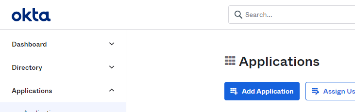
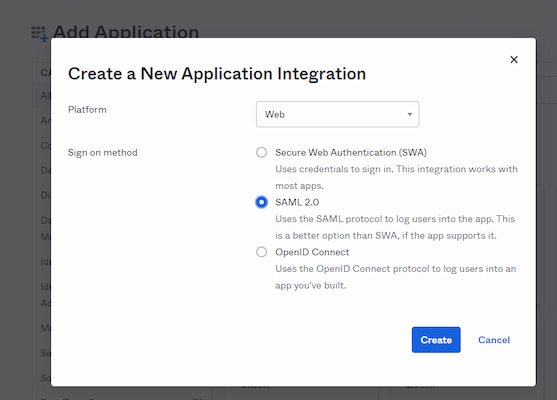
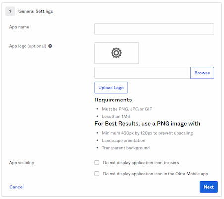
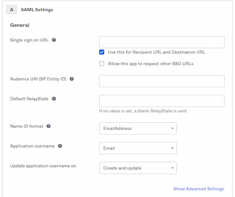
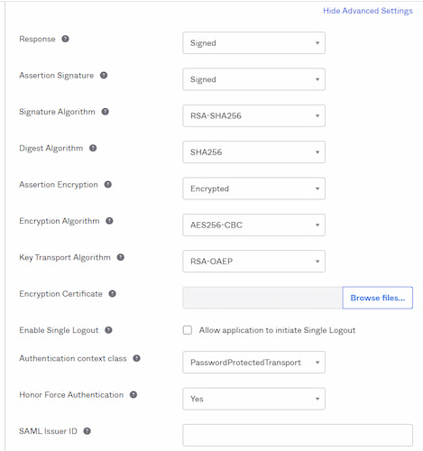
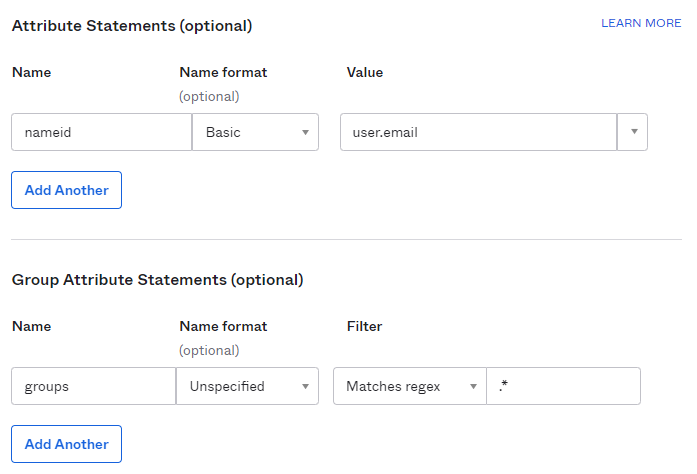
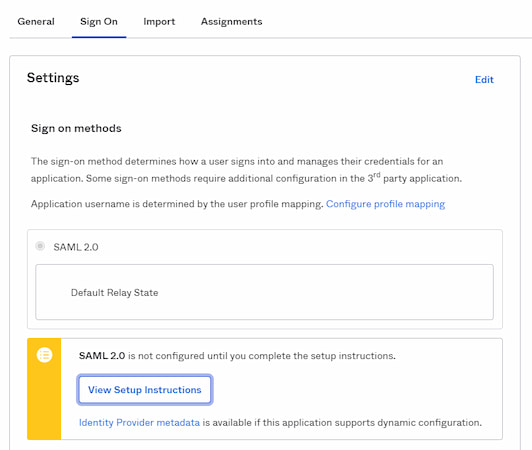
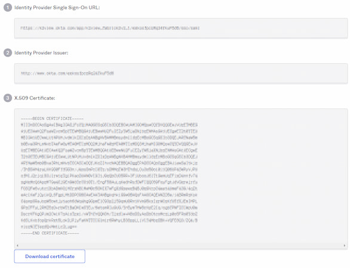

# Okta SAML Setup Guide

This article describes the setup and integration steps to connect your Single-Sign-On account at Okta to Fabric and get the benefits of easy sign-in, along with authentication and authorization control via your admin tools.

## Prerequisite Requirements

- Admin access to Okta.
- Access to Fabric configuration settings. For more information about SAML configuration at Fabric please see [here](/articles/26_fabric_security/13_user_IAM_configiration.md#saml-configuration).

## Configuration instructions: At Okta

Note: The below might be simplified once Fabric will be added to OIN (Okta Integration Network).

#### Launch the Wizard

1. Log into Okta Admin console as an Admin. 

2. In the Admin Console, go to **Applications** > **Applications** via the left navigation bar.

3. At the Applications page, click **‘Add Application’** .

   <table>
   <tbody>
   <tr>
   	<td >
       
       </td>
   </tr>
   </tbody>
   </table>
   
   
4. Click '**Create New App**'.

   <table>
   <tbody>
   <tr>
   	<td width="700pxl">
       
       </td>
   </tr>
   </tbody>
   </table>

5. At the popup - choose "Web" as *Platform* and "SAML 2.0" for *Sign on method* and click on '**Create**'

   <table>
   <tbody>
   <tr>
   	<td>
       
       </td>
   </tr>
   </tbody>
   </table>

#### Configure General settings

6. You will go now thru several wizard steps. Configure the general settings at the '*General*' step as follows and then click '**Next**'

   - fill in app name 
   - upload its logo (optional) 

   <table>
   <tbody>
   <tr>
   	<td width="700pxl">
       
       </td>
   </tr>
   </tbody>
   </table>

#### Configure SAML settings

7. Fill in the following fields also based on information provided by Fabric:

   - **Single sign on URL**, The location (ACS URL) where the SAML assertion is sent with a POST operation back to Fabric.

   - **Use this for Recipient URL and Destination URL**, Select this check box.

   - **Allow this app to request other SSO URLs**, Selecting this option is sometimes useful for integration testing enables configuring multiple ACS URLs. When selecting it, a list of "Requestable SSO URLs" is opened where you can specify one or more entries. 

   - **Audience URI (SP Entity ID)**, The intended audience of the SAML assertion. This is the Fabric **Entity ID**.

   - **Default RelayState**, Can be left empty. This is handled by Fabric, based on its default landing page or upon user's original destination request.

   - **Name ID format**, The username format to be sent in the SAML Response. At the select list choose "*EmailAddress*".

   - **Application username**, The default value to use for the username. At the select list choose "*Email".*

     <table>
     <tbody>
     <tr>
     	<td width="700pxl">
         
         </td>
     </tr>
     </tbody>
     </table>
     
     
   - Click on **Show Advanced Settings** and fill in the following security settings properties. Note that Fabric is setting up to work with high security options and accordingly the following shall be set up:
   
     - **Response**, Choose "*Signed*" to determine that the SAML authentication response message is digitally signed by the IdP.
   
     - **Assertion Signature**, Choose "*Signed*" to determine that the SAML assertion is digitally signed.
   
     - **Signature Algorithm**, Determines the signing algorithm used to digitally sign the SAML assertion and response. Choose "*RSA-SHA256*"
   
     - **Digest Algorithm**, Determines the digest algorithm used to digitally sign the SAML assertion and response. Choose "*SHA256*".
   
     - **Assertion Encryption**, Choose "Encrypted" to determines that SAML assertion is encrypted. 
   
     - **Encryption Algorithm** — Select "*AES256-CBC*" the encryption algorithm used to encrypt the SAML assertion.
   
     - **Key Transport Algorithm** — Select "*RSA-OAEP*" as the key transport algorithm used to encrypt the SAML assertion.
   
     - **Encryption Certificate** — Browse to the public key certificate used to encrypt the SAML assertion, as exported from Fabric. See more  [here](/articles/26_fabric_security/13_user_IAM_configiration.md#saml-configuration) at SAML Configuration > Preparations > Provide to the IDP. Click **Upload Certificate** to upload the certificate.
   
       <table>
       <tbody>
       <tr>
       	<td width="700pxl">
           
           </td>
       </tr>
       </tbody>
       </table>
   
   - **Attribute Statements**, set "*user.email*" attribute, to be sent as custom attribute statements within the the SAML assertions.
   
   - **Group Attribute Statements**, add group attribute statements to the SAML assertion. Name it as "groups", as expected by default at Fabric configuration. 
   
     <table><tbody><tr>    <td width="700pxl">        </td></tr></tbody></table>
   
     
   
8.  Click "**Next**" and complete the wizard with the last Feedback step.
9. Click "**Finish**" to save the application settings. Note - your settings and changes will be applied only on going to the last step/tab and click on Finish.

#### Collect the IDP properties to be set at Fabric configuration

10. Go to the application page (Choose it at your Applications page list or see it when clicking on Finish after editing it) and choose the "**Sign On**" tab.

    <table><tbody><tr>    <td width="700pxl">        </td></tr></tbody></table>

11. Click on "View Setup Instructions"

12. A new browser tab will be opened with the information that need to be copied to Fabric configuration (IDP URL and IDP issuer/entity ID) and the certificate key to be uploaded into Fabric, for signing the authentication requests.

     <table><tbody><tr>    <td width="700pxl">        </td></tr></tbody></table>

13. The first parameter - Identity Provider SSO URL shall be then also copied to the *Single sign on URL* which described above at step #7.

NOTE: Other IDP tasks are out of this article scope, for example at Users and Roles assignments to the app.

