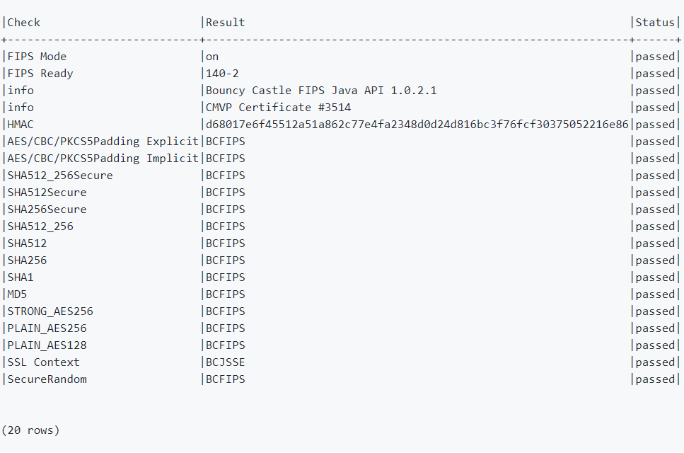

# FIPS Overview

FIPS (Federal Information Processing Standards) is a set of standards that defines encryption algorithms and other digital technology processes for use within non-military federal government agencies and by any government contractors working with these agencies. 

In particular, FIPS 140-2 (Federal Information Processing Standard 140-2) is a security accreditation program for validating that the cryptographic modules produced by private sector companies meet well-defined security standards.
[FIPS PUB 140-2](https://nvlpubs.nist.gov/nistpubs/FIPS/NIST.FIPS.140-2.pdf) provides the full list of instructions and architecture documents needed to meet the Cryptographic Modules Security requirements.


## Fabric and FIPS

K2View has integrated the [Bouncy Castle](https://www.bouncycastle.org/index.html) Java stack to ensure FIPS-compliance for all [Fabric cryptographic algorithms](/articles/26_fabric_security/03_fabric_LUI_encryption.md) used across Fabric's projects.

By default, Fabric boots up with the FIPS mode set to **off**. 
Even when FIPS mode is off, Fabric only uses FIPS-compliant protocols and standards implementions with Fabric cryptographic embedded algorithms.


### FIPS Version Command

The Fabric command ```version fips``` returns the FIPS version currently used and the status of all the cryptographics components included in the system. All crypto algorithms included in the jar files are checked, and either validated or rejected.


#### FIPS with mode set to **ON**

To switch on FIPS mode, carry out the following steps:
- Go to the **$K2_HOME/config/** directory,
- Open the **modules.ini** file
- Modify the fips entry to reflect the following value: ```fips:mode=on```

Fabric's server must be restarted for this change to be effective. 

- In Windows, this can be achieved by clicking on the server ```start/stop``` button on the top-left menu of Fabric Studio. 
- In the Linux environment, from the shell environment, type: ```k2fabric restart```

Once Fabric is online, execute the following command from your shell/CLI window: 

```fabric>version fips;```

The following response is returned:




**Note**:
- BCFIPS means that the algorithm is provided via the jar file bc-fips-1.0.1.jar.
- BCJSSE means that the Java Secure Socket Extension (JSSE) from Bouncy Castle is used.


[](/articles/26_fabric_security/17_user_IAM_custom_authenticator.md)


