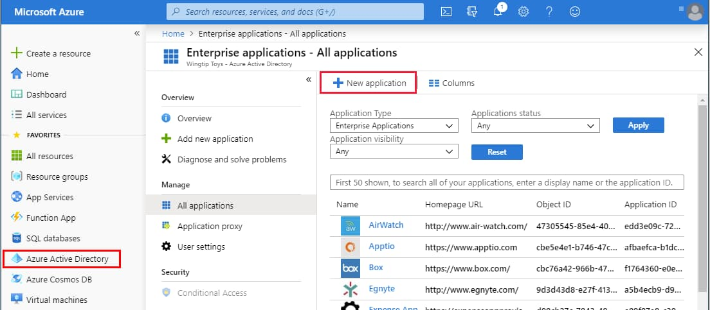
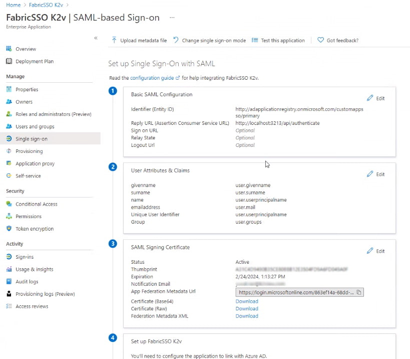
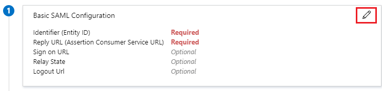
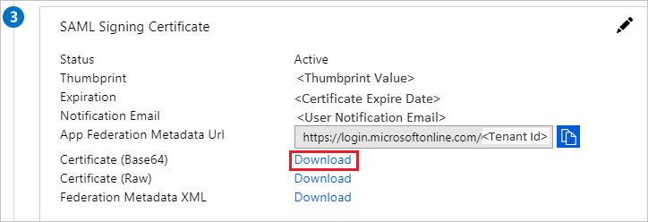
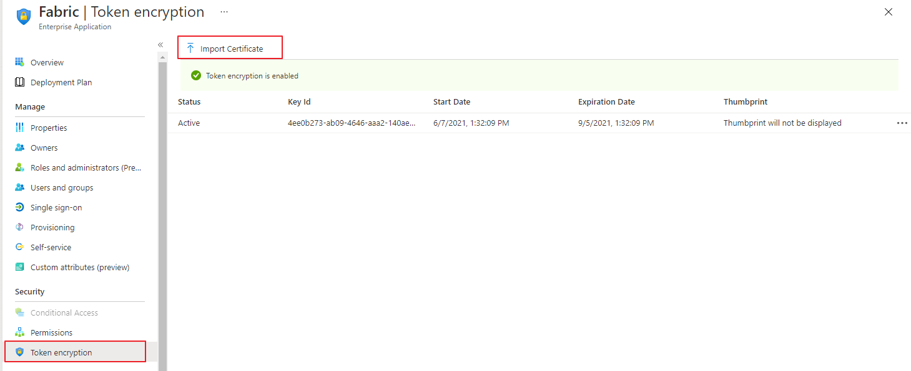
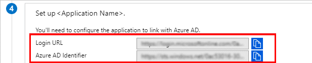

# Microsoft Entra ID SAML Setup Guide

This article describes how to connect your Microsoft Entra ID Single Sign-On (SSO) to Fabric. This integration enables streamlined sign-in as well as admin-level control over authentication and authorization.

You can read more about the guidelines at this link: [Azure AD](https://docs.microsoft.com/en-us/azure/active-directory/saas-apps/fabric-tutorial), as Fabric is a part of the Microsoft's Entra ID app marketplace. 

### Prerequisite Requirements

- Admin access to Microsoft Entra ID.
- Access to Fabric configuration settings. For more information about SAML configuration at Fabric, please read [here](/articles/26_fabric_security_iam/13_user_IAM_configuration.md#saml-configuration).

## Configuration instructions: For Microsoft Entra ID

1. In the [Microsoft Entra admin center](https://portal.azure.com/), on the left navigation panel, select Identity → Overview (or simply Microsoft Entra ID).

2. In the Microsoft Entra ID pane, select Enterprise applications. The All applications page opens.

3. Select **New application**.

   <table>
   <tbody>
   <tr>
   	<td >
       
       </td>
   </tr>
   </tbody>
   </table>

4. In the **Add from the gallery** section, type **Fabric** in the search box.

5. Select **Fabric** from the results panel and then add the app. Wait a few seconds while the app is added to your tenant.

6. On the **Fabric** application integration page, find the **Manage** section and select **single sign-on** to open the **Single sign-on** pane for editing.

7. Select **SAML** to open the SSO configuration page.  

8. Click to edit the various sections, similar to what is shown below (the app name in this example is "*FabricSSO K2v*"):

   <table>
   <tbody>
   <tr>
   	<td >
   	
   	</td>
   </tr>
   </tbody>
   </table>

9. In the **Basic SAML Configuration** section (1), use values matching your Fabric configuration (see the [Fabric SAML Configuration article](/articles/26_fabric_security_iam/13_user_IAM_configuration.md#saml-configuration)).

   - **Identifier (Entity ID)** 
   - **Reply URL (Assertion Consumer Service / ACS URL)** – where Microsoft Entra will send the SAML assertion; typically `https://<HOSTNAME>:<PORT>/api/authenticate` where `<HOSTNAME>` is your Fabric load balancer.
   - **Sign-on URL** (if required) – often the same or similar to the Reply URL, depending on your setup.

   <table>
   <tbody>
   <tr>
   	<td >
   	
   	</td>
   </tr>
   </tbody>
   </table>

10. Edit the **User Attributes & Claims** section (2) and verify that the groups are sent in a claim named "groups".

11. From the **SAML Signing Certificate** section (3), click **Download** to obtain the Microsoft Entra ID certificate key, which will be uploaded into Fabric for signing authentication requests.

  <table>
  <tbody>
  <tr>
  	<td >
  	
  	</td>
  </tr>
  </tbody>
  </table>

12. Upload the public key certificate used to encrypt the SAML assertion, as exported from Fabric. Read more [here](/articles/26_fabric_security_iam/13_user_IAM_configuration.md#saml-configuration) in SAML Configuration > Preparations > Provide to the IDP. 

    <table>
    <tbody>
    <tr>
    	<td >
    	
    	</td>
    </tr>
    </tbody>
    </table>

13. From the 4th section - **Set up \<app-name>** (in our example "*FabricSSO K2v*") - copy the IDP parameters - **Login URL** and **Microsoft Entra ID Identifier**, to be populated at the Fabric SAML configuration for **IDP_ENTITYID** and **IDP_SINGLE_SIGN_ON_SERVICE_URL** parameters.

    <table>
    <tbody>
    <tr>
    	<td >
    	
    	</td>
    </tr>
    </tbody>
    </table>

## Configuration instructions: For Fabric

In addition to the instructions detailed [here](/articles/26_fabric_security_iam/13_user_IAM_configuration.md#saml-configuration), setting up SAML with Microsoft Entra ID requires adding a configuration parameter to the config.ini file: `SECURITY_WANT_NAMEID_ENCRYPTED=false`

