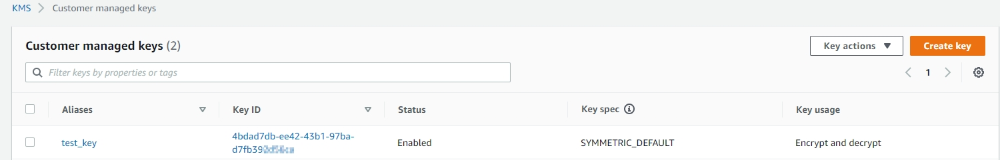
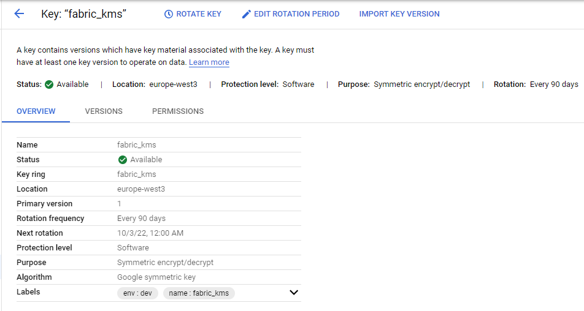

# External KMS-managed Master Key

Fabric master key management mechanism can be integrated with external KMS, since the Fabric v6.5.9 release, as described [here](/articles/26_fabric_security/02_fabric_entities_design.md#kms).

In this model, the Fabric Master Key is protected by an external Key Management Service (KMS) rather than being stored directly within the Fabric platform. Fabric integrates with the external KMS to obtain or unwrap the master key, which is then used within Fabric’s encryption hierarchy to protect the data encryption keys that secure sensitive data.

This approach enables organizations to align Fabric deployments with enterprise security policies by centralizing key governance, audit, and lifecycle management in an external KMS such as AWS KMS, Azure Key Vault, Google Cloud KMS, or KMIP-compatible systems. By externalizing control of the master key, organizations can enforce stronger separation of duties and integrate Fabric encryption with existing enterprise key-management and compliance frameworks.

## Table of Contents

1. [Integration with AWS KMS](#integration-with-aws-kms)

2. [Integration with GCP KMS](#integration-with-gcp-kms)

3. [Integration with KMIP KMS](#integration-with-kmip-kms)

4. [Integration with Thales KMS](#integration-with-thales-kms)

5. [Integration with Fortanix Data Security Manager KMS](#integration-with-fortanix-data-security-manager-kms)

6. [Symmetric and Asymmetric Master Key Encryption Types](#symmetric-and-asymmetric-master-key-encryption-types)

   

To define Fabric to work with KMS, the information should first be acquired from KMS and then set in Fabric.
> By default, Fabric uses its internal master key mechanism.

## Integration with AWS KMS

1. From KMS, get the specific customer master key information - region and customer master key ID

   - *Key ID* - can be seen in the KMS keys list, for example

     

   - *Region* - the region name where the CMK is created. You can see the region (as well as the ID) also when drilling down into the key page, from the key list page (KMS > Customer Managed Keys):

     

2. From AWS, get the user IAM access credentials: access key ID and secret access key.

   - This user shall be granted appropriate permissions to the specific KMS customer master key. Associated users can also be found in the key page > key policy section. 

3. In Fabric, set the values in config.ini under ``[encryption_aws_kms]`` section, according to the KMS information, as follows: 

   ~~~
   [encryption_aws_kms]
   ACCESS_KEY_ID=
   SECRET_ACCESS_KEY=
   REGION=
   CUSTOMER_KEY_ID=
   ~~~
   >  Notes: 
   >
   >  * Relevant config.ini parameters are encrypted and are not saved in the file in their clear/plain form.
   >  * Changes in the config.ini file are performed on all Fabric nodes.
   >  * In case a Fabric node already has a trust with AWS (with AWS's user who shall connect to KMS), then ACCESS_KEY_ID and SECRET_ACCESS_KEY can be omitted.

4. In Fabric, run ``activatekey name='<name>' generatorType='AWS_KMS' storeType='AWS_KMS'``.

### Multi-Region Support

While Fabric might be deployed across several regions, it can use the same KMS key, which is defined in a specific AWS region. It still may be required to work with [AWS multi region keys](https://docs.aws.amazon.com/kms/latest/developerguide/multi-region-keys-overview.html). In this article, AWS recommends considering this option carefully. This article also explains the process of creating multi-region keys. In such a case, config.ini shall be set differently among the Fabric nodes, i.e., with the relevant region's definitions (key-id is the same).

## Integration with GCP KMS

1. From KMS, get the specific master key information - product/project ID, location, master key ID, keyring ID

   

2. From GCP, get the user's access credentials as a JSON file, which can be achieved when creating the user. 

   - This user shall be granted appropriate permissions to the specific KMS master key. At least "*Cloud KMS CryptoKey Encrypter/Decrypter*" role shall be assigned to this user.

3. In Fabric:

   - Locate the credential file on the Fabric server and populate its full path location in the ``CREDENTIAL_FILE`` parameter. Alternatively, the credential file can be set as an environment variable called *GOOGLE_APPLICATION_CREDENTIALS*.
   - Set the values in config.ini under ``[encryption_gcp_kms]`` section, according to the KMS information, as follows:

      ~~~
      [encryption_gcp_kms]
      PROJECT_ID
      LOCATION_ID
      KEY_ID
      KEY_RING_ID
      CREDENTIAL_FILE
      ~~~
      >  Note: 
      >
      >  * Relevant parameters are encrypted and are not saved in the file in their clear/plain form. Additionally, the credential file is encrypted and not stored in its plain form. At runtime, when calling the GCP, Fabric knows how to provide it properly, in its plain form. 
      >  * Changes in the config.ini file are performed on all Fabric nodes.
      >  * In case a Fabric node already has a trust with GCP (with GCP's user or role who shall connect to KMS), then the CREDENTIAL_FILE parameter can be omitted.

4. In Fabric, run ``activatekey name='<name>' generatorType='Java_AES' storeType='GCP_KMS'``.

## Integration with KMIP KMS

1. From KMS, get the specific master key information - partition ID, master key ID, user, password, KMS server URL

2. In Fabric, set the values in config.ini under ``[encryption_kmip_kms]`` section, according to the KMS information, as follows: 

   ~~~
   [encryption_kmip_kms] 
   USER
   PASSWORD
   PARTITION
   KEY_ID
   BASE_URL_TEMPLATE
   ~~~

   >  Notes: 
   >
   >  * The BASE_URL_TEMPLATE, the server URL, shall include the key_id inside the URL with {} wrapping brackets, for example: https://<KMS-host>/api/keys/{key_id}
   >  * Relevant config.ini parameters, like user and password, are encrypted and are not saved in the file in their clear/plain form.
   >  * Changes in the config.ini file are performed on all Fabric nodes.

3. In Fabric, run ``activatekey name='<name>' generatorType='Java_AES' storeType='KMIP_KMS'``.

## Integration with Thales KMS

1. From KMS, get the specific master key information - partition ID, master key ID, user, password, KMS server URL

2. In Fabric, set the values in config.ini under ``[encryption_thales_kms]`` section, according to the KMS information, as follows: 

   ~~~
   [encryption_thales_kms]
   USER
   PASSWORD
   AUTH_DOMAIN
   KEY_ID
   AAD
   BASE_URL_TEMPLATE
   ~~~

   >  Notes: 
   >
   >  * The BASE_URL_TEMPLATE, the server URL, shall include the key_id inside the URL with {} wrapping brackets, for example: https://<KMS-host>/api/keys/{key_id}
   >  * Relevant config.ini parameters, like user and password, are encrypted and are not saved in the file in their clear/plain form.
   >  * Changes in the config.ini file are performed on all Fabric nodes.

3. In Fabric, run ``activatekey name='<name>' generatorType='Java_AES' storeType='KMIP_KMS'``.

## Integration with Fortanix Data Security Manager KMS 

[Fortanix's KMS](https://www.fortanix.com/platform/data-security-manager/key-management-service) service is part of their Data Security Manager platform.

1. At config.ini:

   * Set the following attribute (located at [fabric] section) as following  `PACKAGE_NAMES_CLASS_LOADING_FILTER=com.k2view.,com.fasterxml.`

   * Set the values for the following parameters at ``[encryption_fortanix_kms]`` section, according to the KMS information

     ~~~
     [encryption_fortanix_kms]
     KEY_ID
     API_KEY
     END_POINT_URL
     ALGORITHM
     MODE
     AD
     TAG_LEN
     ~~~

   >  Notes: 
   >
   >  * KEY_ID stands for the Security Object ID at Fortanix KMS.
   >  * API_KEY - as generated for the app, at Fortanix KMS.
   >  * AD - Authentication Data - is optional
   >  * TAG_LEN - The authentication tag length, used in AES-GCM and other AEAD algorithms. Commonly to be set to 128 (stands for 128 bit length)
   >  * Attributes which considered as secrets are encrypted and are not saved in the file in their clear/plain form.
   >  * Changes in the config.ini file are performed on all Fabric nodes.

   

2. Set certificate when needed for trust, as any communication with external servers.
2. In Fabric console/terminal, run this command: ``activatekey name='<name>' generatorType='Java_AES' storeType='FORTANIX_KMS'``.

## Symmetric and Asymmetric Master Key Encryption Types

While KMS providers enable working with either symmetric or asymmetric encryption types, Fabric supports the symmetric key type. This type should be selected in KMS when creating the master key. 

