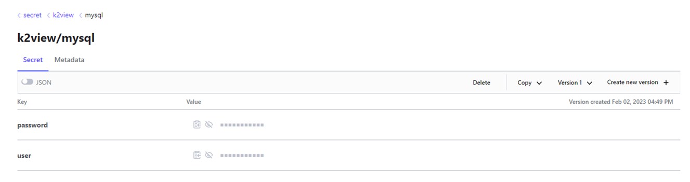

# Integrating Secrets Management Services - Interface Editor 

Fabric supports integration with Secrets Management services, offering several benefits. While secrets are not stored in Fabric itself, only their reference IDs are. 

To use a Secrets Management service, in the Interface Editor (including Environments Editor), you should mark the required interface connection details as those that should be taken from the Secrets Management service.

## Table of Contents

1. [Interface Connection Settings](#interface-connection-settings)  
   1.1 [Setting and marking an interface property to use a Secrets Management service](#setting-and-marking-an-interface-property-to-use-a-secrets-management-service)  
   1.2 [Provider-Specific Considerations and Usage Patterns](#provider-specific-considerations-and-usage-patterns)  
   - [HashiCorp Vault](#hashicorp-vault)  
   - [CyberArk CCP](#cyberark-ccp)  
   - [One Identity Safeguard](#one-identity-safeguard)  
2. [Multi Secrets Management Services and Instances Support](#multi-secrets-management-services-and-instances-support)  
   2.1 [Multi Secrets Management Services](#multi-secrets-management-services)  
   2.2 [Multi Secrets Management Service Instances](#multi-secrets-management-service-instances)  

## Interface Connection Settings

* Each Secrets Management service has its key pattern, usually by hierarchy (e.g., with a dot sign inside the key name); you should follow that pattern.

* The Secrets Management service can also be used for interface connection details inside environments. 

  > Each one of the environments and the interfaces is independent, in a way that some environments may use Secrets Management services, whereas others, such as local testing, might not. 

* You can use the *Test connection* option to validate the connection settings, also when the Secrets Management service is activated.

* The following properties—host, port, database, username, and password—can be set in the Secrets Management service for the DB type Interfaces. For all other interfaces, all connection detail properties can be set to use the Secrets Management service.  

### Setting and marking an interface property to use a Secrets Management service

<studio>

The ${secretmanager:<id-at-secret-manager>} pattern should be used in the interface property value. For example: `${secretmanager:mysql-password}`, where mysql-password is the key that exists in the Secrets Management service.

</studio>

<web>

1. Turn on the key switch, located beside each relevant property ( &rarr; ).
1. Enter the key as it appears in the Secrets Management service.
1. When specifying the keys, you can use either dedicated patterns, as describe in the later *Provider-Specific* section, or use URL query string.

> Notes: 
>
> * When turned on, a default value appears, as a proposed **key name** that is composed of the interface name and the property name. For example, the proposed key name for *Host* property in the ASSETS_DB interface would be `ASSET_DB.Host`. This is only a suggested name, and you should strictly align with the same name that exists in the Secrets Management service.
> * When turned on, a property considered a password will not be masked; namely, it will remain visible in its original clear form.

</web>

### Provider-Specific Considerations and Usage Patterns

The following are additional notes and considerations regarding **specific** Secrets Management service providers:

#### **HashiCorp Vault**

   * **KV (key-value) secrets engine** in HashiCorp Vault is designed as a hierarchical key-value store.
   
      - Each **path** is like a folder (for example: `k2view/mysql`).
      
      - Inside each path, you can store multiple key-value pairs (e.g., `user`, `password`, `host`, `port`. In the below illustrated example we show `password` and `user`).
      
        
   
   * When retrieving secrets via the API, Vault returns **all** keys under that path. However, Fabric allows you to specify which key you wish to use.
   
      The pattern is `key-path.key`. For example: <studio>${secretmanager:k2view/mysql.user} and ${secretmanager:k2view/mysql.password}</studio><web>k2view/mysql.user and k2view/mysql.password</web>
   
   As mentioned, URL query string can be used, where *secretName* and *secretKey* shall be provided as aprameters. For example, assuming the secret entry is named "k2view/mysql.prod" then for the password key, the pattern shall be: `secretName=k2view/mysql.prod&secretKey=password`.
   
   * HashiCorp has two versions, and in each version, the key paths differ. However, this difference in paths does not affect how the keys work or how you configure them in the interface properties. For more information about the versions, read [here](https://developer.hashicorp.com/vault/docs/secrets/kv).

   

#### **CyberArk CCP**

   * You should specify the *folder* and/or the *safe-name* parameters by using the '&' concatenating pattern, e.g., `Safe=my-safe&Folder=my-folder&Object=mysql-password&AppID=`
>  

   > The AppID parameter is optional and can be added for more granularity, rather than a general AppID that can be set in the config.ini file.

#### **One Identity Safeguard**

   * You should specify both the *asset name* and the *account name* parameters by using the '&' concatenating pattern, e.g., `asset_name=OracleDB&account_name=PreProd`

  

## Multi Secrets Management Services and Instances Support

You can use several Secrets Management services on the same Fabric, per your needs, as demonstrated [here](/articles/26_fabric_security_sm/04b_secret_manager_config.md#multi-secrets-management-providers-and-instances-support).

### Multi Secrets Management Services

If you provision multiple Secrets Management service providers in the config.ini file (and they are set to 'ENABLED'), **Fabric** will attempt to access each one to obtain the secrets, until it succeeds. 

For example, suppose you provision both AWS and HashiCorp Secrets Management service provider sections in the config.ini file, and you have a secret property whose key is 'oracle-password'. In such a scenario, Fabric will first call AWS to look for this key. If found, Fabric would use it; if the key is not found, Fabric will call the next provider in our example, HashiCorp. Calls are made in the order in which the providers' sections appear in the config.ini file.

When using several Secrets Management service providers, it is recommended to specify the provider's name for each interface property explicitly. This helps to prevent mistakes and to avoid unnecessary calls to irrelevant providers.

To do this, you should insert the provider's name, followed by a colon, and then the name of the key. <studio>The pattern is: ${secretmanager:secretmanager_provider-name:my_secret} </studio><web>secretmanager_provider-name:my_secret</web>

For example, if you use HashiCorp Vault for storing SQL Server DB connection secrets, while Google Cloud Secret Manager is being used for storing BigQuery connection secrets, then the interface property values representing the keys may look like the following:

<web>

SQL Server DB connection secrets are "hashicorp:AdventureWorks-User" and "hashicorp:AdventureWorks-Password", assuming that in HashiCorp there are corresponding "AdventureWorks-User" and "AdventureWorks-Password" keys.

</web>  

<studio>

"${secretmanager:hashicorp:AdventureWorks-User}" and "${secretmanager:hashicorp:AdventureWorks-Password}", assuming that in HashiCorp there are corresponding "AdventureWorks-User" and "AdventureWorks-Password" keys. 

</studio>

### Multi Secrets Management Service Instances

When different Secrets Management service **instances** are provisioned in the configuration, you should explicitly specify which one of them is to be used for each interface secret property.

To do this, you should insert the instance's name, followed by a colon, and then the name of the key. The pattern is: <Stduio>${secretmanager:my_new_secretmanager:my_secret} </studio><web>my_new_secretmanager:my_secret</web>

Given example: 

1. Two sections are provisioned in the config.ini file: `[encryption_prod_sm]` and `[encryption_qa_sm]`, both of which use AWS as the Secrets Management service provider. 
2. As per this example, when different Secrets Management service providers are being used, the "prod" instance is aimed to be used for Production source system secrets, while the "qa" instance is aimed to be used for secrets related to QA target system. 
3. There are two environments, one for Production interfaces and one for QA interfaces.
4. One of the databases is Oracle, which is used for both the source and target systems.

Then, in the Production environment, the **value** of the **password property** may look like "prod:oracle1-pswd", whereas in the QA environment, the corresponding property would be "qa:oracle1-pswd" (naturally, if the key in the QA Secrets Management service is different, then the same must also be reflected in the interface property).

At runtime, **Fabric** will act according to these definitions in a way that whenever it encounters properties with the *prod* prefix, it will connect to the Secrets Management service that is defined in the `encryption_prod_sm` section of the config.ini file.

