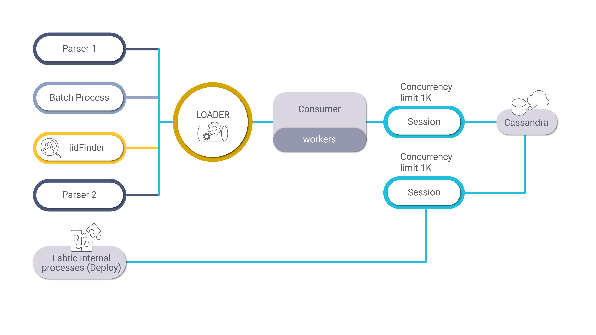

# Cassandra Loader Overview

Fabric uses the [Cassandra DB](/articles/02_fabric_architecture/06_cassandra_keyspaces_for_fabric.md) as a storage layer and a Fabric application management database. Various Fabric processes, such as batches or iidFinder, need to be able to simultaneously insert massive amount of data into the Cassandra DB without getting the *Busy pool exception* yet consuming the hardware effectively. In addition, Fabric needs to be able to run internal processes, such as [Fabric Deployment](/articles/16_deploy_fabric/01_deploy_Fabric_project.md), without the dependency on other processes running on the same Fabric session.

**Cassandra Loader** is a library that supports massive WRITE operations to Cassandra DB. This library exposes a simple API to be invoked by the user code in the Fabric's projects implementation.

The Cassandra loader is supported for [batch processes](/articles/20_jobs_and_batch_services/11_batch_process_overview.md), iidFinder and parsers. The loader has a [default architecture] however it's possible to override the default settings such as a mode (batch or single), queue size, number of threads, etc by the loader's configuration.

The [loader's configuration](TBD) also enables the loader to work by predefined priority, for example processing the batches before the iidFinder and within the batches process LU batches before the general ones.

The [session can be configured](TBD) as well, for example enabling the definition of separate sessions per loader and iidFinder.

The JDBC connection of the loader can be defined using a [DbCassandraLoader interface type](TBD), to prevent the definition of the Loader section hardcoded.

### Cassandra Loader Default Architecture

