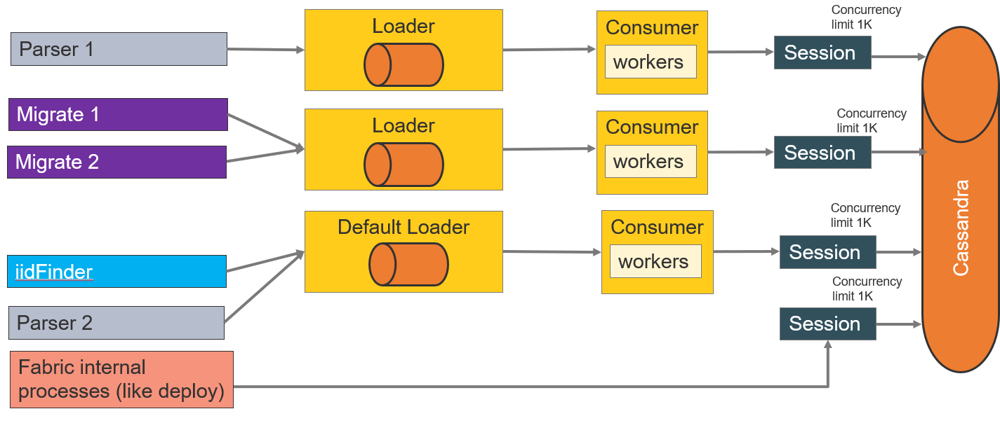

# Cassandra Loader Architecture

### Default Architecture

### Custom Architecture

The default architecture defines two sessions: one for the loaders to perform WRITE operations to the Cassandra DB and another one for the Fabric internal processes like Deploy. The internal processes run on a separate session to prevent the dependency on other heavy processes.

This architecture can be changed by the configuration to reach the optimal efficiency using the *config.ini* file. The optimal configuration is based on the combination of the effective project's hardware consumption, the best possible performance and the least number of *Busy pool exceptions*. 

The configuration parameters override the default settings, thus via the configuration it is possible to define several loaders, each one with separate session. For example, one loader per each parser or separate loaders for parsers and for iidFinder. 

 

