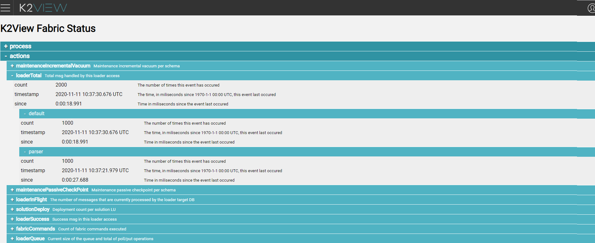

# Loader Invocation and JMX

### Loader JDBC Connection

The loader's JDBC connection is defined using a **Cassandra Loader** interface type. Its only property is the loader's section name which represents a section in the  *config.ini* file. When the provided section name does not exist in the configuration, a new section with the relevant configuration parameters must be added to the config.ini file.

The section name property of the **Cassandra Loader** interface can be overridden for each [environment](/articles/25_environments/01_environments_overview.md).

### Loader Invocation Code Example

The loader is invoked from the user code in the Fabric project's implementation via the **Cassandra Loader** interface type.

Below is an example of the loader's invocation from the Web Service. The loader is invoked via the **loaderDefaultInterface** interface defined as a **Cassandra Loader** interface type.

Note that since the loader is executed asynchronously, the commit will block the thread until all executed queries are completed.

~~~java
Db ci = db("loaderDefaultInterface");

for (int i = 0; i < 1000; i++){
    ci.execute("INSERT INTO k2view_LoaderLu.tbl(CUSTOMER_ID,test) VALUES ('2','McLoaderPopulation"+i+"');");    
}
ci.commit();
~~~

### JMX Metrics

When running the Cassandra loader, you can monitor it using [K2View Web Framework Statistics](/articles/30_web_framework/02_preintegrated_apps_overview.md).

