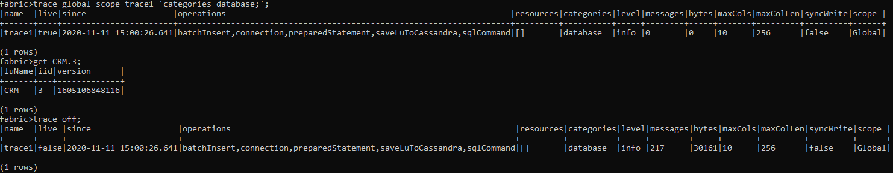
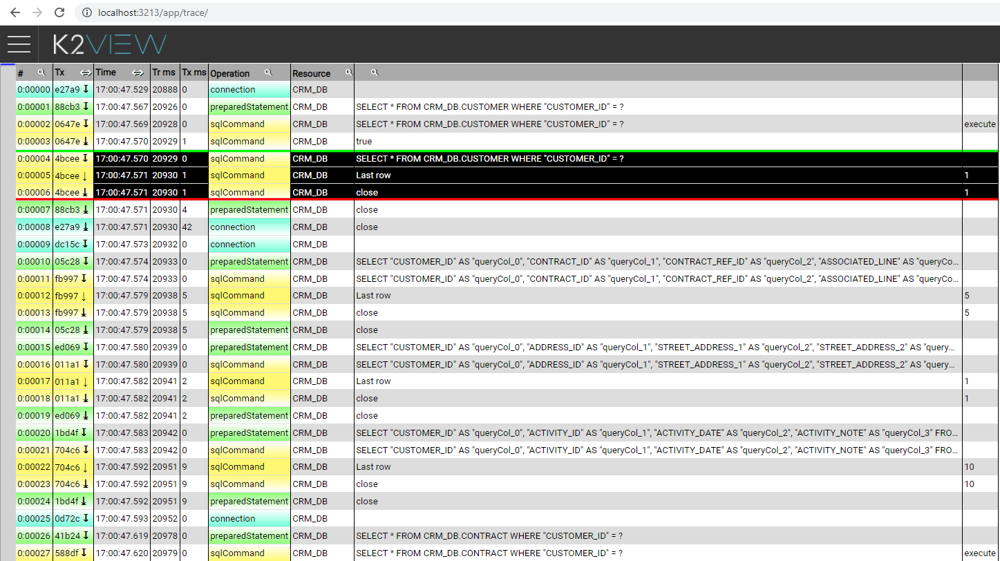
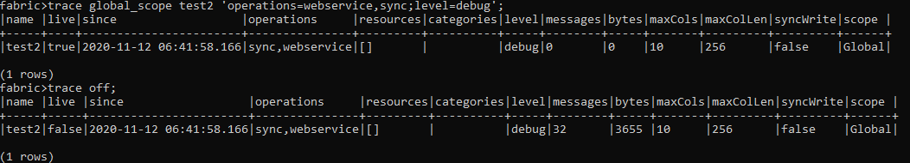
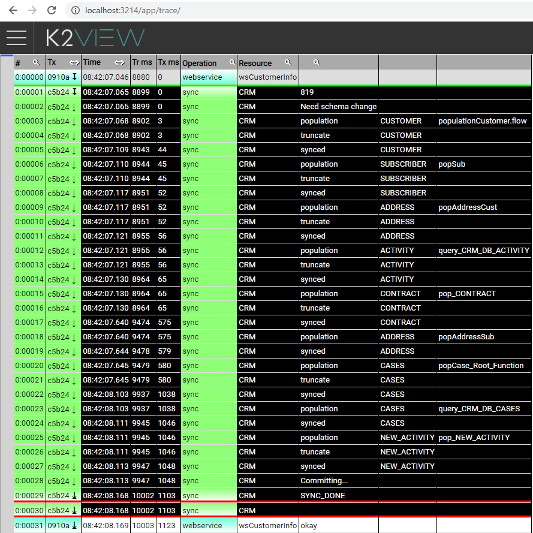

# Trace Examples

### Trace Sync from Source

Trace a database category to analyze the following:

-  Select statements run on source interfaces.
-  Timing as a result of a sync command. 

The trace can be run on a global or session level.

A trace file named test1.fabrictrace has been created under $FABRIC_HOME/traces.

File content 

### Trace Web Service

Trace overall timing of a Web Service and drilldown into the sync process, check how long it takes to sync each table and population.

The getCustomerInfo Web Service was called after activating the Trace mechanism.

A trace file has been created under $FABRIC_HOME/traces called test2.fabrictrace.

File Content 

 
 

