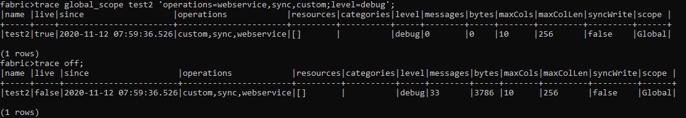
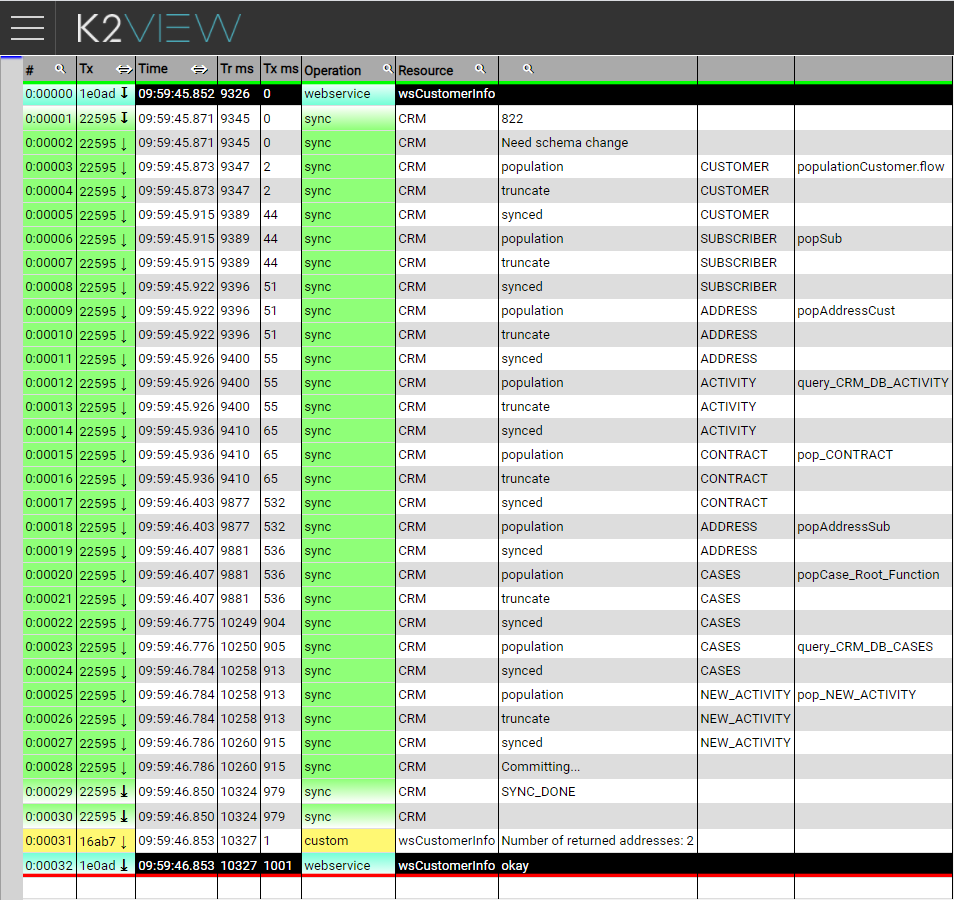

# Trace Custom

Users can create their own customized trace messages that can be incorporated into an existing trace file.

A custom trace file can be created using the trace API that is part of the Fabric user code package.

For example, to add tracing to a Web Service to count the number of addresses related to a synced LUI.

```java
String sql = "SELECT CUSTOMER_ID, SSN, FIRST_NAME, LAST_NAME FROM CUSTOMER";

Db.Rows rows = ludb("CRM", ID).fetch(sql);
String addresses = fabric().fetch("SELECT COUNT(*) from address").firstValue().toString();
WebServiceUserCode.trace("wsCustomerInfo").print("Number of returned addresses: "+addresses);

return rows;
```




A trace file named test2.fabrictrace has been created under $FABRIC_HOME/traces.

File content 



A custom message has been created that points to the number of addresses created for LUI 822. The operation has been set to custom and the resource is aligned with wsCustomerInfo, the name defined in the implementation.

[](03_trace_examples.md)[](05_trace_view.md) 


