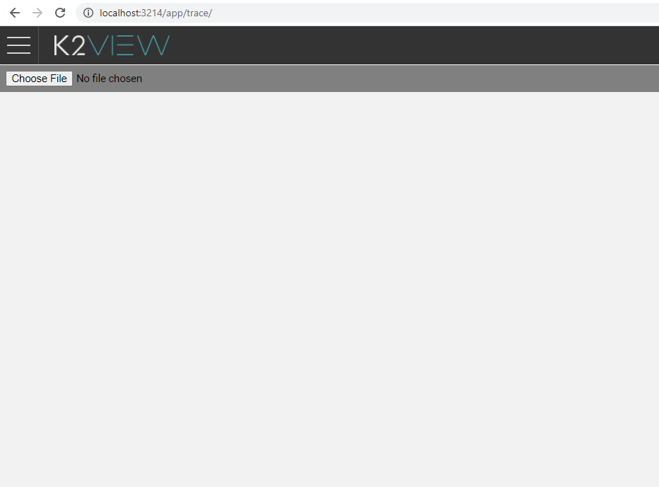
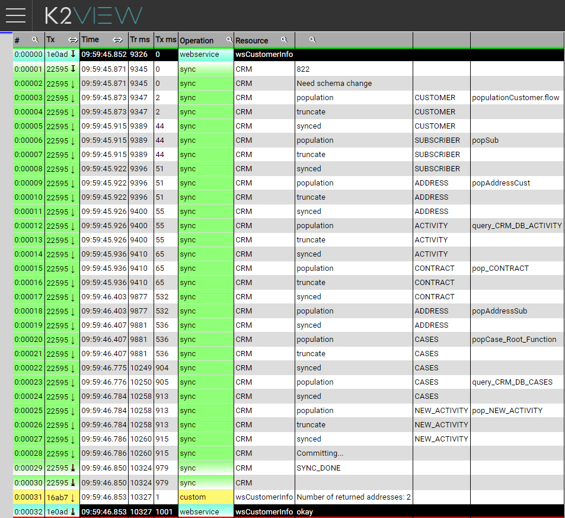

# Trace View

Trace files can be viewed using a dedicated web application that is already incorporated into the Fabric Web framework. The site can be accessed using the following URL http://[Fabric IP address]:[Fabric port]>/app/trace/. 

After logging into the Trace view application, you will be asked to choose the trace file to be loaded.

Once a trace file has been loaded, you can navigate, filter or sort it and zoom into the different execution blocks for better tracking. In the example below the Web Service call is the marked block defined under the same transaction ID.

