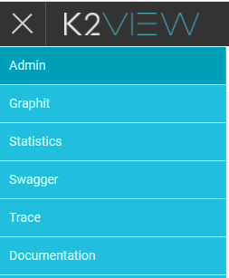
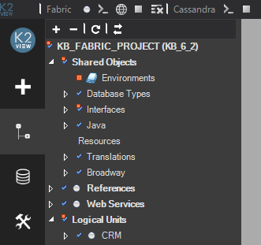
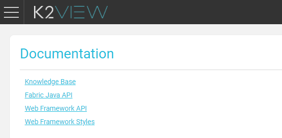

# Web Framework Overview 

The K2View Web Framework is a container that hosts multiple web applications and provides out-of-the-box services. It improves the system's usability by providing one unified tool with links to several frequently-used web applications running on the same application server. Instead of manually typing the URL to open each application, users can log into the K2View Web Framework and select the application from the context menu. 

The K2View Web Framework includes a list of [pre-integrated applications](02_preintegrated_apps_overview.md) such as the Admin. Several of the pre-integrated applications expose the Fabric commands and by that enable the user to work with web-based graphic tool rather than with the Fabric Console.  

### How Do I Access the Web Framework?

The Web Framework can be opened using the following URL: **http://[Fabric IP address]:[Fabric port]** or using the  icon in the Fabric Studio toolbar. For example http://localhost:3213.

Login to the Web Framework using your username and password. This enables a Single Sign On (SSO) process with secure authentication to multiple applications using one set of credentials. Access to the various functions in the applications is restricted by a user's [Fabric credentials](/articles/17_fabric_credentials/01_fabric_credentials_overview.md) and is handled in the same way as in the Fabric server.

### How Can I Integrate an Application into the Framework?

The K2View Web Framework includes several [pre-integrated applications](02_preintegrated_apps_overview.md). Additional applications can be  integrated into the Framework with minimal development effort by adding the application name to the **apps.json** file and a folder with the application's code in the Fabric installation folder in Windows in: **K2View\Fabric_[version]\Server\fabric\staticWeb**. Make sure to clean the browser's cache after updating the **apps.json** file.

The order of the applications in the context menu list is determined by their order in **apps.json**. 

The Framework exposes a **k2api** object with various methods that can be used by the application, such as navigation, formatting and Fabric commands invocation. An application's style can be set either using K2View Web Framework style sheets (**k2.css**) for a unified look & feel or using a different set of style sheets. The Framework supports any application type (multi-page or single page) and any routing method (History API, hash-based or regular links).

**Example**

To add the **My Web App** application to the Framework, add the following to the **apps.json** file:

~~~json
   {
      "name": "My Simple Web App",
      "appId": "myApp",
      "hidden": false
   }
~~~

In addition, create the **myApp** folder (the folder name must be the same as the JSON **appId**) in the same location and save the application code there. Clean the browser's cache before opening the Web Framework with the new application.

For detailed documentation about the integration development guidelines, supported methods and code examples, refer to **Documentation > Web Framework API / Styles** in the K2View Web Framework's menu.

### Static Web Resources Within LU

Starting from Fabric 6.5.2, it is possible to locate all static web resources under the LU. 

As a result, once the LU is deployed, the static web resources are deployed as a part of it.

To introduce a new application using the Fabric Web Framework, follow these steps:

* Create a new folder, called **web**, under the LU implementation folder.

* Under the web folder create an additional folder representing your new application and put all the web static resources under this folder.

* Add the new application to the **apps.json** file. This file can either be modified on the server side on the existing location, or you can copy the **apps.json** file to the web folder on the client side and edit accordingly. Fabric will consider the **apps.json** file under the web folder with higher priority.

