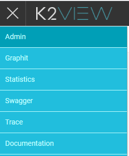
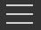
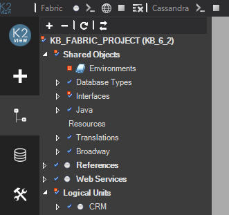

# Web Framework Overview 

The K2view web framework is a container that hosts multiple web applications and provides out-of-the-box services. It improves the system's usability by providing one unified tool with links to several frequently used web applications running on the same application server. Instead of manually typing the URL to open each application, users can log in to the K2view web framework and select the application from the context menu. 

The K2view web framework includes a list of [pre-integrated applications](02_preintegrated_apps_overview.md) such as the Admin. Several of the pre-integrated applications expose the Fabric commands and by that enable users to work with web-based graphic tool rather than with the Fabric Console.  

<studio>

### How Do I Access the Web Framework

The web framework can be opened by using either the **http://[Fabric IP address]:[Fabric port]** URL or the  icon in the Fabric Studio toolbar, e.g., http://localhost:3213.

Log in to the web framework using your username and password. This enables a Single Sign On (SSO) process with secure authentication to multiple applications using one set of credentials. Access to the various functions in the applications is restricted by a user's [Fabric credentials](/articles/17_fabric_credentials/01_fabric_credentials_overview.md) and is handled the same way as in the Fabric server.

</studio>

Read [here](/articles/04_fabric_studio/30_build_web_apps.md) how to build your application and integrate it into the Fabric web framework.

