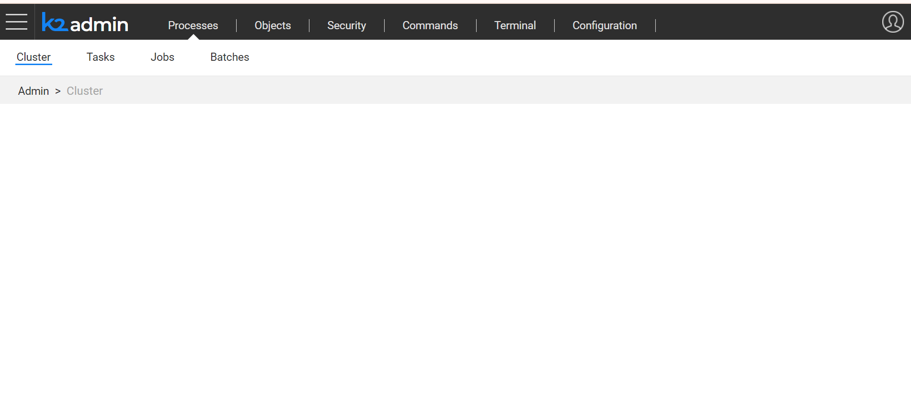

# Web Admin

Admin is a graphical web-based application used to conduct various Fabric Server and Cassandra activities, like monitoring batch processes, managing user credentials or executing other Fabric commands. Admin wraps [Fabric commands](/articles/02_fabric_architecture/04_fabric_commands.md) using REST APIs invoked by the Web Framework UI so that the commands can be run in a more user-friendly manner. 

Admin has four categories where each category has additional sub-categories. Navigation through the application is via the Web Framework's menu whereby breadcrumbs display a user's location. 

For example, the following image shows that the user navigated to **Admin > Processes > Cluster**.

### Admin Categories

* **Processes**, initiate and monitor Fabric [batch processes](/articles/20_jobs_and_batch_services/11_batch_process_overview.md) and [jobs](/articles/20_jobs_and_batch_services/01_fabric_jobs_overview.md) according to a selected time period. This category includes the following sub-categories:

  * Cluster, displays information about the cluster and nodes such as the Node ID, Status, IP, etc.
  * Tasks, Job and Batches, displays running processes. Set the filter to show a list of processes that are currently active, or run today, 3 days ago, etc. To start a job or a batch, select the LU name and set the relevant parameters.

* **Objects**, display various Project level objects such as:
  
  * Interfaces, displayed with their connection status.
  * List of [CommonDB reference tables](/articles/22_reference(commonDB)_tables/01_fabric_commonDB_overview.md). To initiate a sync of the reference tables, select either the LU or a specific table.
  * List of the implementation LU objects with the option to download their implementation's zip.
  * List of [Environments](/articles/25_environments/01_environments_overview.md) and their active status, as well as the option to switch to another environment.
  
* **Security**, manage a user's access control and restrictions via the [Fabric credentials mechanism](/articles/17_fabric_credentials/01_fabric_credentials_overview.md):
  * Roles, view existing roles and create new roles.
  * Permissions, grant access to a role on a resource or revoke it.
  * Users, view existing users, delete or create new users, assign roles to users or revoke them.
  * API Keys, view existing security tokens, generate new ones, assign roles to API keys, remove or delete them.
  
* **Commands**, write and execute one or more existing Fabric commands. 

  * Write the command in the command line. Click the command in the list to display its description and usage.

    

  * Click  to add a line to run several commands. 

    
    
  * Click Execute to run the commands.

* **Terminal,** bringing fabric console experience to a web application. 

* **Configuration,** enables a user with suitable permissions to the admin page to change values in the config.ini file for its specific node and save changes (overrides) in the system DB
* Configuration filtering options
Show All - all configuration parameters are viewable in the table
Overrides Only (default view) - Only parameters which values were changed are viewable
Once the "Hidden" checkbox is checked on, the hidden parameters are also viewable
All table columns can be filterrd, sorted and grouped by
  Update a Paramater
1. To update a parameter value go to the value column and edit (use the edit icon or simply edit) the value of a specific parameter you wish to change.
2. Once changed, the entire row wil automatically be highlighted to indicate a change applied
3. Once saved, the highlighted indication will be turned off
4. In case the changed parameter requires a restart to be applicable, a corresponding icon in the relevant key column indicates that along with a tooltip indication
5. Once a change in a parameter that requires a restart occurs and saved to system DB, the icon indication will blink and a popup indication on the save button wil be highlighted, indicating this change will be applicable only after a restart.
6. Revert to default - Once a value was changed but not saved to system DB, the revert option will enable you to go back to the original default value. Upon saving the change, the revert option will not be available anymore until another change will be applied.
7. When switching to the overrides only view after a change that wasnt saved but was applied, once reverting to default value, the parameter will be removed from this view.
8. Reset drops will delete the overrides - if you have settings for a specific machine it is advisable to save them in the config.ini manually/hardcoded and use the following setting: IGNORE_CONFIG_OVERRIDES_ON_START for recovery purposes in case of bad value which will ignore all applied overrides.
 Add a Parameter
1. Clicking on the Add Parameter button will open a new editable row highlighted in green
2. The section column will provide a dropdown list of existing sections to choose from, or alternatively enter a new section.
3. Use the edit icons on the 'KEY' and 'VALUE' columns to enter a new value
4. Note - the 'Description' field is not editable
5. A delete button in the revert column will enable to  delete the new added parameter row.
6. Adding an existing parameter which is configured as hidden, will override its value once saved.

### Admin History

Admin displays the history of the Fabric commands executed on the server in a small popup screen in the right lower corner which can be expanded to show several rows.

For example, when navigating to **Admin** > **Processes** > **Job** and applying the filter to display today's job, the History popup displays the command: 

~~~
jobstatus 1 days ago
~~~

