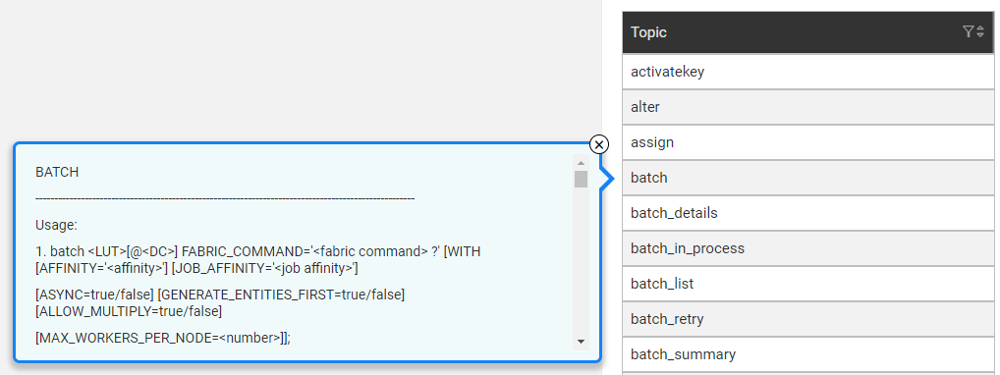
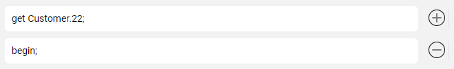

# Web Admin

Admin is a graphical web-based application used to conduct various Fabric Server and Cassandra activities, such as monitoring batch processes, managing user credentials or executing other Fabric commands. When processing Fabric commands, Admin wraps them up so that they are run and monitored in a more user-friendly manner. 

Admin has four categories where each category has additional sub-categories. Navigation through the categories is via the framework's menu whereby **breadcrumbs** display a user's location in the application. 

For example, the following image shows that the user navigated to **Admin > Processes > Cluster**.

### Admin Categories

* **Processes**, initiate and monitor Fabric [batch processes](/articles/20_jobs_and_batch_services/11_batch_process_overview.md) and [jobs](/articles/20_jobs_and_batch_services/01_fabric_jobs_overview.md) according to a selected Time Period. For example, Today, 3 days ago, etc:

  * Cluster, displays information about the cluster and nodes such as the Node ID and its Status, IP, etc.
  * Tasks, Job and Batches, displays currently running processes. Select the Time Period to show a list of processes that can be Active, Today, 3 days ago, etc. To start a job or a batch, select the LU name and set the relevant parameters.

* **Objects**, display various Project level objects such as:
  
  * Interfaces, displayed per the deployed [environment](/articles/25_environments/01_environments_overview.md).
  * List of [CommonDB reference tables](/articles/22_reference(commonDB)_tables/01_fabric_commonDB_overview.md). To initiate a sync of the reference tables, select either the LU or a specific table.
  * List and details of various implementation objects: Project's LUs, Web Services, Broadway flows, etc.
  
* **Security**, manage a user's access control and restrictions via the [Fabric credentials mechanism](/articles/17_fabric_credentials/01_fabric_credentials_overview.md):
  * Roles, view existing roles and create new roles.
  * Permissions, grant access to a role in a resource or revoke it.
  * Users, view existing users, delete or create new users, assign roles to users or revoke them.
  * API Keys, view existing security tokens, generate new ones, assign roles to API keys or remove or delete them.
  
* **Commands**, select and execute one or more existing Fabric commands. 

  * Click the command to display its description and usage.

    

  * Click  to add a line to run several commands. 

    

### Admin History

Admin displays the history of the Fabric commands executed on the server in a small popup screen in the right lower corner which can be expanded to show several rows.

For example, when navigating to **Admin** > **Processes** > **Job** and applying the filter to display today's job, the History popup displays the command: 

~~~
jobstatus 1 days ago
~~~

