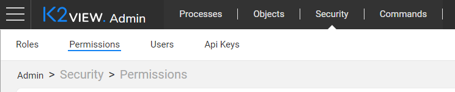
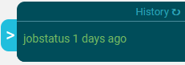

# Web Admin Application

Admin is a web application that enables a user to conduct various Fabric Server and Cassandra activities, such as monitoring batch processes, managing user credentials or executing other Fabric commands. It is a graphical web-based tool that wraps up the Fabric commands and enables running and monitoring them in a more user-friendly manner. 

Admin includes 4 categories available via the framework. The navigation through them is done using the framework menu. 

### Admin Categories

* **Processes**, to initiate and monitor the Fabric [batch processes](/articles/20_jobs_and_batch_services/11_batch_process_overview.md) and [jobs](/articles/20_jobs_and_batch_services/01_fabric_jobs_overview.md) per the selected time period (for example, today, 3 days ago, etc).
* **Objects**, to display the status of various Project level objects such as:
  * Interfaces, displayed per each deployed [environment](/articles/25_environments/01_environments_overview.md).
  * List of [CommonDB reference tables](/articles/22_reference(commonDB)_tables/01_fabric_commonDB_overview.md).
  * Other implementation objects: Project's LUs, Web Services, Broadway flows, etc.
* **Security**, to manage the user access control and restrictions via the [Fabric credentials mechanism](/articles/17_fabric_credentials/01_fabric_credentials_overview.md):
  * Roles, to view the existing and create new roles.
  * Permissions, to grant access to the role on resource or to revoke it.
  * Users, to view the existing, delete and create new users, to assign roles to user or to revoke it.
  * API Keys, to view the existing security tokens and to generate a new one, to assign roles to API keys, to remove it or delete it.
* **Commands**, to select and execute any existing Fabric command (one or more). 

### Admin History

Admin displays the history of the commands executed on the framework. It is shown in a small popup screen in the right lower corner of the main page which can be expanded to show several rows.

