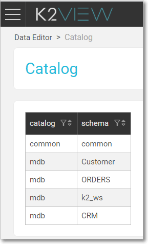

# Data Editor

Data Editor is a graphical web-based application used for viewing and editing Fabric [LU](/articles/06_LU_tables/01_LU_tables_overview.md) and [reference](/articles/22_reference(commonDB)_tables/01_fabric_commonDB_overview.md) tables. Data Editor also shows the data structure and relationships between the tables within a Fabric LU scheme.

The Data Editor is part of the K2View Web Framework.

### Catalog Screen

When opening the Data Editor it first shows the **Catalog** - a table that contains the current schemes of the deployed project, that is - the LUs and the references/common. Click an entry in the list in order to navigate to the [Scheme Viewer](05_data_editor_scheme_viewer.md) screen.

Following is an example of a project's Catalog:

###### 

Click on the top action bar **Refresh** buttonIn order to refresh the table list.

 

