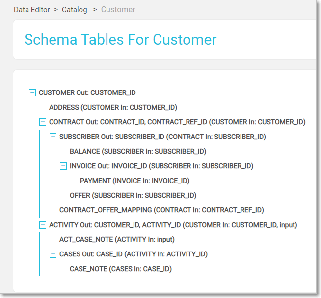

# Data Editor Scheme Viewer

The Scheme Viewer shows the scheme structure and enables fetching its data. It is shown once a unit - a specific LU or "common", is selected at the Data Editor [Catalog](04_data_editor_overview.md#catalog-screen) screen. Depends on the selected unit type, either of the following will be shown.

### LU Tables

This screen enables viewing the LU scheme structure and fetching an LUI of a specific IID. It is built from two main areas - top **Action Bar** and main **Scheme View** areas.

#### Scheme View

The scheme's tables are shown in a top-down nested tree view, starting from the LU's root table. The scheme structure can be viewed also via the [Studio LU Scheme Window](/articles/03_logical_units/03_LU_schema_window.md#logical-unit-lu-schema) as well as at the [Data Catalog web app](/33_data_catalog/01_data_catalog_overview.md), where you can also see the data flows. 

* Each table is presented with its
  * **input** - its predecessor in the hierarchy and their linkage field/s
  * **output**, if exists - the linkage field/s to its linked tables. 
* Each table is clickable leading to the table Data Viewer screen.
* The scheme name appears in the screen title as well as breadcrumbs at the top data editor catalog bar.  

 Note: a table might appear more than once when there is more than a single population stage.

#### Actions Bar

The screen contains a top actions bar

 The first three elements are used for LUI fetch:

* **Sync Mode** - select between *Off* or *On*. *Force* option is not exposed at the Data Editor app. 

  The data is then fetched according to the [Sync Behavior](/articles/14_sync_LU_instance/10_sync_behavior_summary.md#sync-behavior---summary-table) rules.

* **IID** text field, where the LU IID shall be populated.

* **Set IID** button which activate the LUI data retrieval. 

  * Once LUI is found its value is shown at top, in an input chip form, used also as a breadcrumbs when drilling down the tree. 
  
    
  
  * In case LUI is not found an error message will appear.

NOTE: you can drill down in the tree, even when IID is not defined and set it later, in any level. In such case, when LUI is fetched, you will see that level data. 

 The Other available actions are:

* **Reset** LUI - by clicking on the X at the IID chip 
* **Delete IID** button, used to unload the LUI from Fabric. The button is enabled when LUI is fetched, otherwise it is disabled and grayed-out.
* **Refresh** button, used to refresh the retrieved data.
* **Info** button, used to see the sync information - when this data was synced and when it is going to be synced next, according to the [Sync Behavior](/articles/14_sync_LU_instance/10_sync_behavior_summary.md#sync-behavior---summary-table) rules. this button is enabled only when LUI is fetched, otherwise it is disabled and grayed-out.

### Refences / Common Tables 

 This screen presents the common table list. Click an entry in the list in order to navigate to table Data Viewer screen.

 