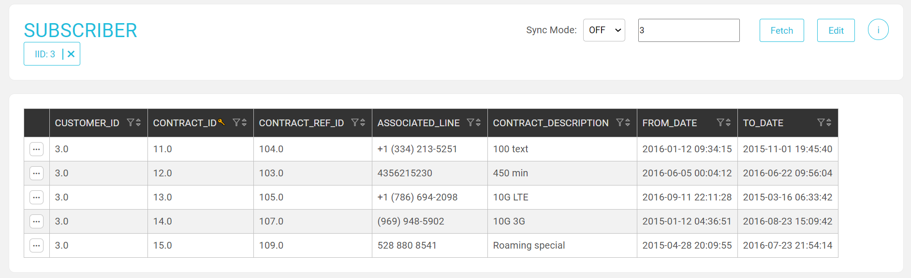
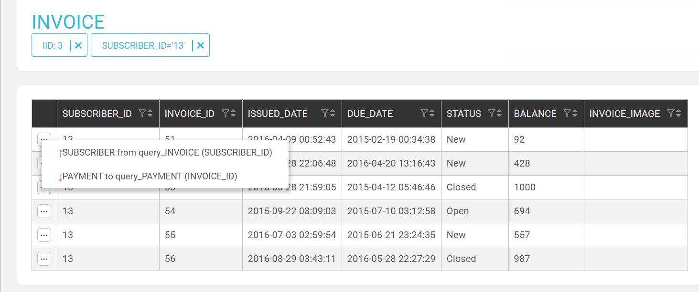
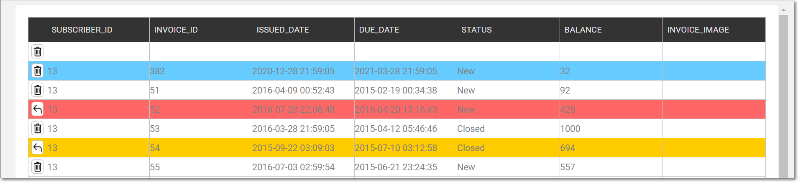

# Data Editor Table

Information in the Data Editor is displayed in a table and can be edited, added, updated and deleted using the functions displayed in the top Actions bar.  

### Actions Bar

<table style="border-collapse: collapse; width: 100%; height: 68px;" border="1">
<tbody>
<tr style="height: 17px;">
<td style="width: 12.4762%; height: 17px;">Fetch</td>
<td style="width: 87.5238%; height: 17px;">Click to fetch data for the IID. This option is also available for inner screens that are not the LU's root table.</td>
</tr>
<tr style="height: 17px;">
<td style="width: 12.4762%; height: 17px;">Info</td>
<td style="width: 87.5238%; height: 17px;">Click to display the synced data.&nbsp;</td>
</tr>
<tr style="height: 17px;">
<td style="width: 12.4762%; height: 17px;">Edit</td>
<td style="width: 87.5238%; height: 17px;">Click to switch to Edit mode.</td>
</tr>
<tr style="height: 17px;">
<td style="width: 12.4762%; height: 17px;">IID X</td>
<td style="width: 87.5238%; height: 17px;">Click to reset the LUI.</td>
</tr>
</tbody>  
</table> 

To fetch data, select the **sync-mode**, enter the **IID** and click **Fetch**.

For information about synced information, click Schema Tables. 

### Table Data

A table displays data on the population method, query and customized functions and can be filtered, sorted and navigated by clicking the XXX icons at the top of each column:  

-  To filter data, click XXX to open the XXX and enter the filtering criteria.
-  To go to a linked table and edit its hierarchy in the schema, click XXX, click the table and then click xxxx xxxx. 
 
In the following Invoice table, a customer LUI has several subscribers each having several invoices. The data has been filtered to display Subscriber #13 and its invoices:   

   
  
-   Click a table to display its data and its predecessor in a lower hierarchy.  
-   To remove the filter, click IID X.

Note that a table displays the first 1000 entries.
  
    

#### Table Edit Mode 

The Editing option is permissions based.
1.  To edit the table's content, click **Edit** to switch to Edit mode:  
    -  Click Delete to remove a table entry.
    -  Click XXXX to add a row above.

    Once an entry is added, edited or marked for deletion it is highlighted: 

    -  New = blue.
    -  Edited = orange.
    -  Deleted = red. 

2.  To undo your changes, click **Revert** or **Delete**.
3.  To implement your changes, click **Update** in the top Actions bar.

 

Note that once Update is clicked edit actions cannot deleted or reverted.

