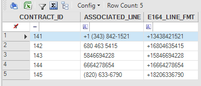

# External JARs

### Overview

Fabric enables using Java JAR libraries in Fabric objects like functions and Web Services to expedite project timelines via 3rd  party code that already implements tasks like specific calculations or mapping. Using JAR libraries reduces the need for self-coding and also saves time during testing. There is also an option for customers to use their own code like for security or connectivity which is then used by Fabric. 

This article discusses the following: 

- Development and debugging stages.
- Deploying Java JAR libraries in the server. 
- Step-by-step example.

### How Do I Use a New Library

#### Development and Debug Stage
1. Save the JAR file in the lib **root** directory in the **[Fabric Projects Directory]\\[Project Name]\lib** folder. Make sure not save the JAR file in the subdirectories since this has an impact when exporting the project. 
2. To add the JAR file to the CLASSPATH in Fabric during runtime, if the Fabric Studio is open, do either:
   -   Go to the top left menu bar, click **Stop** and then **Start** to restart the local Fabric server. 
   -   Close and reopen the project you are working on. 
3. Go to the **project tree**, select the **Logical Unit** and **category** and then open the **Java file**.
4. Add the code for importing the required JAR classes. 
5. Use the JAR classes and methods in the Fabric object.

#### Deploying Java JAR Libraries in the Server

After the JAR files are associated to a specific project in the Fabric Studio, to be deployed they must be copied into the project in the Fabric server.

1. Copy the JAR files into the **/home/k2view/ExternalJars/** folder in the Fabric server.
2. Restart the Fabric server.

Note that the JAR files are copied to **All** Fabric nodes. 

For more information refer to [Fabric Server - Main Directories](/articles/02_fabric_architecture/02_fabric_directories.md). 

### Example

This example demonstrates how a Telco carrier can align their subscribers phone numbers to follow the [E.164](https://en.wikipedia.org/wiki/E.164) standard format. The phone numbers, which are populated by CRM representatives or by integrated DBs, might vary. For example, in the Training demo project, the LU **CONTRACT** table contains the following associated phone numbers for customer ID "55": "+1 (343) 842-1521", "680 463 5415", "5846694228", "(820) 633-6790". 

To enable the carrier to use a single format, the Google [libphonenumber](https://github.com/google/libphonenumber) library is used in the demo project, as follows:

1. Add an additional column to the **CONTRACT** table, named ***E164_LINE_FMT*** populated by an [enrichment function](/articles/10_enrichment_function/01_enrichment_function_overview.md). 

2. Save the  [libphonenumber](https://github.com/google/libphonenumber) JAR (e.g. "libphonenumber-8.12.13.jar") in the **[Fabric Project's Directory]\demo\lib**. 

For example:

   

   Note that JAR is highlighted in yellow.
   
3. Restart the Fabric local server or reopen the project.

4. Create a new enrichment function named **E164PhoneFormat** in the **CUSTOMER** LU: 

   - Add the relevant JAR classes in the **Logic** Java file:

     ~~~java
     import com.google.i18n.phonenumbers.Phonenumber.PhoneNumber;
     import com.google.i18n.phonenumbers.PhoneNumberUtil;
     ~~~

   - Use the following function code: 

     ~~~java
     log.info("E164PhoneFormat function is running");
     
     PhoneNumberUtil phoneUtil = PhoneNumberUtil.getInstance(); 
     PhoneNumber parsedNumber = null; 
     
     String SQLNumber="SELECT ASSOCIATED_LINE FROM CONTRACT";
     String SQLFormattedNumberE164="UPDATE CONTRACT SET E164_LINE_FMT  = ? where  ASSOCIATED_LINE = ?";
     String SQLFormattedNumber="";
     String formattedNumber="";
     String cellValue="";
     
     Db.Rows rows = fabric().fetch(SQLNumber);
     for (Db.Row row:rows){ 
     	cellValue=""+row.get("ASSOCIATED_LINE");
     	parsedNumber = phoneUtil.parse(cellValue, COUNTRY_CODE); 
     	formattedNumber = phoneUtil.format(parsedNumber, PhoneNumberUtil.PhoneNumberFormat.E164);
     	fabric().execute(SQLFormattedNumberE164,formattedNumber,cellValue);
     }
     ~~~

     \* Note that the COUNTRY_CODE is defined in [Fabric Globals](/articles/08_globals/01_globals_overview.md).  

Asociate the enrichment function to the **CONTRACT** table and then deploy the **CUSTOMER** LU. Search for customer "55" via the the Data Viewer:

The new table's column is populated with the required single format in all associated lines.
