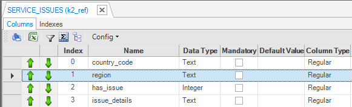
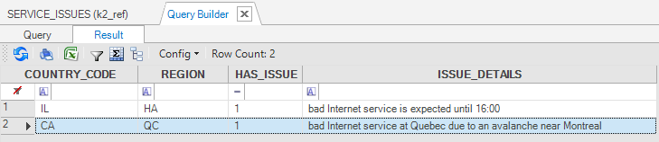
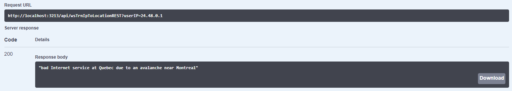

# Invoking an HTTP REST Call

### Objective and Introduction

In this example we demonstrates how a Telco mobile carrier can use REST API to reveal customer's location (such as country, city, long&lat coordinates) by customer's current IP domain. 

In our example use case, the carrier wishes to give good response to its customers who might call and complain about a bad service they are experiencing (note that such case is already applied at a Fabric project, with a proactive messages that are sent to customers). 

Let's assume that there is a feed which update Fabric with carrier's regional issues and that this information is store at a Fabric reference table. When customer calls to the call center to complain, a match between current customer's location and that reference table. For this, the carrier CRM can call Fabric WS which will response with indication if the customer located in a known bas service area.     

We will show in our example such web-service (WS). For information of creating web-services within Fabric please read [here](/articles/15_web_services_and_graphit/03_create_a_web_service.md)

We will use REST API call to one of the existing IP Geolocation services - https://ip-api.com/. This service provides several response format options and we will use the JSON format, using a JSON parser provided in an external JAR. 

See here to learn about [External Jars](/articles/31_external_resources/01_external_jars.md) usage. In this example we will omit the external JAR handling guidelines.


### Example 

#### Preparations

For this demo example we created a new reference table **SERVICE_ISSUES**. We populated it with 2 rows, simulating feed process.




#### Implementation

1. Place the "org.json" JAR at the fabric JARs directory (can be downloaded [here](https://mvnrepository.com/artifact/org.json/json). for more information about this library see [here](https://github.com/stleary/JSON-java)). 

2. Add these *import* statements to the Logic file. We place this WS at Web Services --> Translation directory/category ("k2_ws\Translation"):

   ```java
   import org.json.JSONObject;
   import org.json.JSONArray;
   
   import java.net.HttpURLConnection;
   import java.net.URL;
   ```

   The first 2 lines aimed for JSON parsing while the later are for performing the HTTP call (Java internal support, thus no need an external JAR). 

3. Following is the web service code example. 

   It gets one input parameter "userIP" and return back a string with the known status and information. 

   ```java
   log.info("wsTrnIpToLocationREST");
   
   String issueStatusDetails = "No issues were found at customer's region";
   String SQLREF="SELECT ISSUE_DETAILS from SERVICE_ISSUES where COUNTRY_CODE = ? and REGION = ? and HAS_ISSUE = 1";
   
   URL url = new URL("http://ip-api.com/json/" + userIP);
   HttpURLConnection con = (HttpURLConnection) url.openConnection();
   con.setRequestMethod("GET");
   int responseCode = con.getResponseCode();
   log.info("wsTrnIpToLocationREST - Response code for user domain IP " + userIP + ": " + responseCode);
   
   if (responseCode == 200) { 
   
   	BufferedReader in = new BufferedReader(
     	new InputStreamReader(con.getInputStream()));
   	String inputLine;
   	StringBuffer content = new StringBuffer();
   	while ((inputLine = in.readLine()) != null) {
       	content.append(inputLine);
   	}
   	
   	in.close();
   	JSONObject jsonResponse = new JSONObject(content.toString());
   	String countryCode = jsonResponse.getString("countryCode"); 
   	log.info("countryCode: " + countryCode);	
   	String region = jsonResponse.getString("region");
   	log.info("region: " + region);
   	//log.info("city: " + jsonResponse.getString("city"));
   	//log.info("lon: " + jsonResponse.getNumber("lon"));	
   	//log.info("lat: " + jsonResponse.getNumber("lat"));
   	
   	String issueStatusDB = fabric().fetch(SQLREF,countryCode,region).firstValue().toString();
   	log.info("status: " + issueStatusDB);
   	if ((issueStatusDB != null) && (!issueStatusDB.isEmpty())) {
   		issueStatusDetails = issueStatusDB;
   	}
   	
   } else {
   	log.info("The request call was failed");
   }
   
   con.disconnect();
   
   return issueStatusDetails;
   
   ```
   
The WS steps:
   
* Look for the userIP input parameter and call to the REST API service to get information about it.
   * In case getting back good response, parse it and take the countryCode and the region.
   * look at the SERVICE_ISSUES if there is an open issue (*has_issue = 1*) for this country-code and region.
   * In case an open issue is found - set it as the WS result string. 
   

   
Here is an execution example result of this WS, get as an input IP = "24.48.0.1":
   

   

   
   ### Authentication & Authorization
   
   In some cases the REST API requires authentication & authorization to be sent as headers. At the "java.net" library which we used in the example, this can be achieved by using the **setRequestProperty** method. For example, when the API provider supplied us user-name + passwords and works with base authentication, the following can be used:
   
   ```java
   String encoded = Base64.encode(username+":"+password);
   cons.setRequestProperty("Authorization", "Basic "+encoded);
   ```

​		There are alternative HTTPP client JAR, such as apache, which already have specific "setHeader" method.


[](/articles/31_external_resources/02_invoke_remote_server_calls.md)[](/articles/31_external_resources/04_invoke_soap_call_example.md)