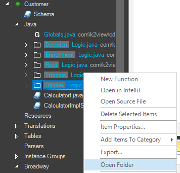
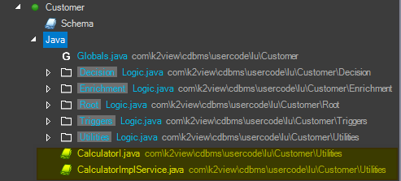
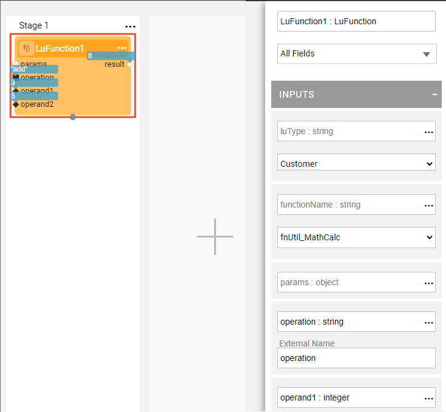
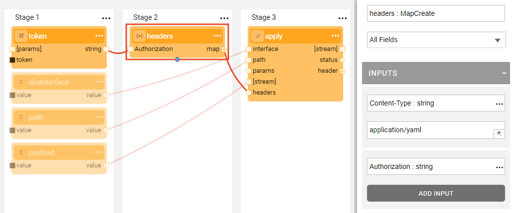

# Invoking a SOAP Call

### Introduction

SOAP is an XML-based messaging protocol for web services. While many services now work with REST with JSON, SOAP is still used in the Billing and CRM arena and also for common services like security which use SAML.

On client side, SOAP processing starts by analyzing the WSDL (Web Services Description Language), an XML-based document that describes the web service and specifies its location, methods, data types, expected parameters and returned data structures. 

In this article we explain the recommended SOAP implementation and best practices and provide an example that demonstrates the steps for working with SOAP.

### Preparations

Due to the complexity of WSDL, it is recommended to use ready-made Java code or libraries. Note that this supportive code is dedicated per web service and is not  generic.

There are two options for integration with a SOAP service provider:

* The service provider supplies the JAR holding the relevant code. This usually contains the service's endpoint and authorization keys. In this scenario, save the JAR according to the [external JAR's](/articles/31_external_resources/01_external_jars.md) instructions. 

* The service provider publishes the service's WSDL, either as a URL or a file, which the client learns. In this scenario, we recommend using the **wsimport** JDK command line tool which discovers the WSDL and translates it into Java code form.

The following describes a service published using WSDL and discusses the preparation steps that enable implementing the code in Fabric functions. Note that these steps are not required when using a JAR.

#### 1. WSDL Discovery: Generating SOAP Client Code

The SOAP client code is generated via the JDK `wsimport` command which expects this syntax: `wsimport [options] <wsdl>`.  

The WSDL path's parameter can be a URL or a file saved in the local file system, according to the method used by the service provider to expose it. 

It is recommended to use the following command options:

* `-Xnocompile`, do not compile the generated Java files. This process is redundant since the build process is implemented by Fabric.
* `-keep`, keep the generated Java file.
* `-p`, package name. 

For more information about using this command, click [Syntax](https://docs.oracle.com/javase/7/docs/technotes/tools/share/wsimport.html#Syntax).

When running this command a new package containing the Interface and Service Java files is automatically generated holding the Java methods that can be used in Fabric code. The file names are derived from the names in WSDL.

Note that the generated code uses the JAX-WS built-in JAVA library whereby an external JAR is not required.

#### 2. Copying the Files Generated in Step 1 into the Fabric Folder

1. Go to the Fabric Studio and select the **Category** folder in the Java section.
2. Right click and select **Open Folder**:



3. Go to folder holding the generated code, during [Preparation](/articles/31_external_resources/04_invoke_soap_call_example.md#preparations). Scroll down and copy the files at the end of the tree into the folder opened in step 2 above. The files are displayed in the Fabric Studio Tree under the Java section but not under the **Category**.

#### 3. Update and Verify the Service URL

The WSDL contains the service address which is automatically populated in the generated Java files.

If the supplied WSDL does not contain the actual service address, open the service file, search for the URL value and then either verify or update it.

### Example

In the following example, a **Calculator** Web Service provides basic add, subtract, multiply and divide mathematical operations.

1. To generate the SOAP client Java files, run the following command. The WSDL is published as a URL endpoint:

   `wsimport -Xnocompile -keep -p com.k2view.cdbms.usercode.lu.Customer.Utilities http://127.0.0.1:10000/calcServer?wsdl`

   Click to access the [WSDL](/articles/31_external_resources/calculator.wsdl) in this example.

   As shown in the `-p` package option in the command, this service is used in a specific LU.  

2. Copy the generated files into the Fabric folder. The Fabric Studio tree is illustrated below with yellow highlights.

   


3. Update and verify the service URL. The generated code in the example refers to the localhost, which also runs the demo Web Service, and does not need to be updated.

4. Use the generated code. The available methods can be found in the generated interface file. In our example, the generated code contains the add, divide, subtract and multiply methods.

The following code is an example of a Utility function which gets the operation and 2 operand numbers as input parameters. Its output is the calculated result:

   ```java
   CalculatorImplService service = new CalculatorImplService();
   CalculatorI calc = service.getCalculatorImplPort();
   
   int result = 0;
   if (operation.equals("add")) {
   	result = calc.add(operand1, operand2);
   } else if (operation.equals("subtract")) {
   	result = calc.subtract(operand1, operand2);
   } else if (operation.equals("multiply")) {
   	result = calc.multiply(operand1, operand2);
   } else if (operation.equals("divide")) {
   	result = calc.divide(operand1, operand2);
   }
   log.info("result: " + result);
   return result;
   
   ```

   The first two lines initiate the generated code.

   

  The following is an example of how a **LuFucntion** Actor in Broadway uses this function:



**Note**

For your convenience, the following [demo server-side service](/articles/31_external_resources/SOAP_Server_Example.zip) can be used to implement the above example. The demo server contains three Java files:
-  **CalculatorI**, an interface which contains the declarations according to the WSDL published.
-  **CalculatorImpl**, which implements the calculation.
-  **CalcPublisher**, the executable class that publishes the Web Service and exposes it in the localhost in port 10000.

 

The following is an example of how a **Http** Actor in Broadway can be used to make a SOAP call:




To make a SOAP call, you must define Content-Type as **application/soap+xml** in the header. The above example defines the Content-Type as well as the Authorization parameters. However if the Http actor is using a predefined HTTP interface, you don't need to pass the Authorization string.


[](/articles/31_external_resources/03_invoke_http_rest_call_example.md)
