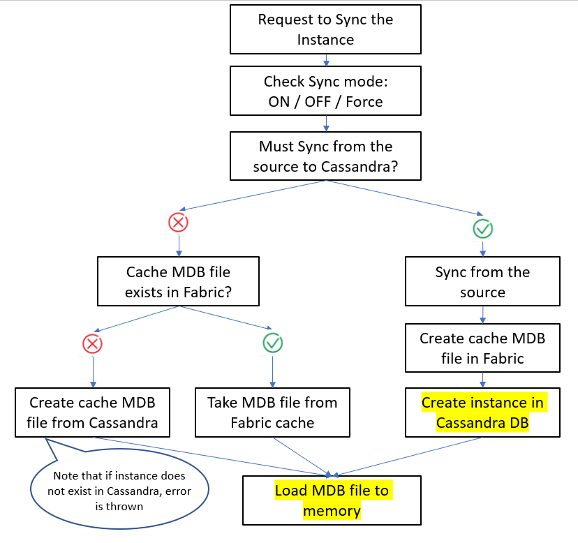

# How Is Storage Managed During Sync?

When an instance needs to be brought to Fabric, the [GET](/articles/02_fabric_architecture/04_fabric_commands.md#get-lui-commands) command is invoked.

The GET command is used to synchronize one or multiple instance IDs (LUI) from the source systems to Fabric and to load them into the Fabric's memory. 

During GET, Fabric either retrieves the data from the source (if Sync is needed), or brings the latest version of the LUI from Cassandra DB. The LUI version number is kept in **k2view_[LU_name].entity** table together with the corresponding MicroDB blob.

To optimize the LUI retrieval process, the latest version of LUI is saved in the Fabric cache in addition to the Cassandra DB. However the cache size is limited per the configuration in config.ini file.