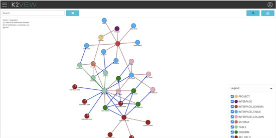

# Data Catalog Overview

The Fabric Data Catalog is a graphical tool that visualizes the data structure, relationships and data flow within the Logical Unit. 

The Data Catalog describes how an organization collects, transforms and stores its data inventory. Due to its user-friendly UI, the catalog enables users to follow a data flow from its source to its target and by that drastically increases a user’s comprehension of an organization’s data model. For example, when developing a Web Service, it can assist to clarify the source system of the Web Service’s required output fields.

Moreover, the solution answers data privacy requirements for compliance with GDPR, CCPA and other global data protection regulations by enabling users to know how Fabric brings data from source systems, where in Fabric it is stored and how it is published externally.

