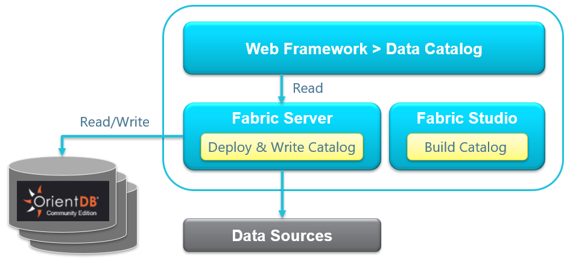

# Data Catalog Overview

<a href="https://www.k2view.com/platform/data-catalog/" target="_blank">Data Catalog</a> is a web application based on a distributed OrientDB (Apache 2) graph database that visualizes a project’s meta data structure and the relationships between its entities.  Fabric creates a JSON-format representation of the project, deploys it to the Fabric server and uses the OrientDB to create and save the graph structure. Data Catalog also enables the user to define additional nodes and relations if the automatic process doesn’t find them or if they are not part of the project. The resulting Data Catalog becomes available to the Web Framework for navigation. 

The Data Catalog describes how an organization collects, transforms and stores its data inventory. Due to its user-friendly UI, the catalog enables users to follow a data flow from its source to its target and by that, drastically increases a user’s comprehension of an organization’s data model. 

For example, when developing a Web Service, it can assist to clarify the source system of the Web Service’s required output fields.

Moreover, the solution answers data privacy requirements for compliance with GDPR, CCPA and other global data protection regulations by enabling users to know how Fabric brings data from source systems, where in Fabric it is stored and how it is published externally.

### Data Catalog Components

The Data Catalog introduces a list of data entities and the relationships between them. These data entities include Project, Interface, Schema, Table, Column and more. 

The data relationships indicate the connections between the data entities and determine their hierarchy. For example:

* {Interface} CONTAINED in a {Project}
* {Schema} CONTAINED in a {Project}
* {API} USE a {Table}

The entities and the connections between them are used to parse the data, analyze it and display it from the Project level, through the Schema to the API and Table fields level. 

The solution has a Build Catalog option that creates JSON format files representing an entire project. The automatically created catalog files can be overridden if needed.

  

