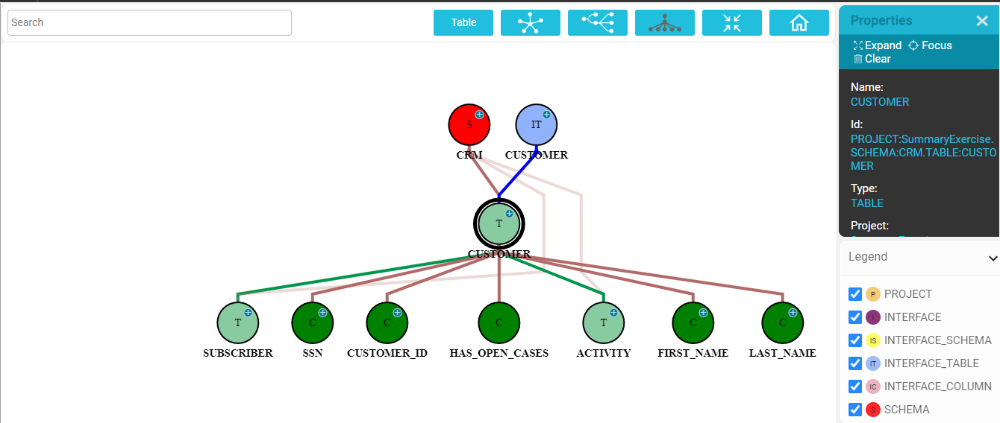

# Data Catalog User Interface

Data Catalog is a web application based on a distributed graph database OrientDB (Apache 2). The catalog's UI enables the users to move through a data model’s graph, zoom in / out from one level to another and filter specific elements. 

### How Do I Access the Data Catalog?

The Data Catalog is accessed from the [K2View Web Framework](/articles/30_web_framework/01_web_framework_overview.md). Select the **Data Catalog** from the Web Framework context menu to display the circle representing your project. If multiple projects were deployed to the same OrientDB database, all of them will be displayed.

### How Do I Navigate Through the Data Catalog?

The navigation through the Data Catalog is performed using the following tools:

* Search the required data element using the **Search** area in the top left corner of the screen. The search is performed using the *search-as-you-type* field type. The search results are presented in a table, enabling the user to either add an entity to the tree or to replace the tree focus to the selected entity.

  

* Change the tree view by using the icons in the top right corner of the screen:

  

  * Display the tree horizontally, vertically or using a centralized view by clicking one of the icons. 
  * Zoom the tree to fit the screen by clicking the  icon.
  * Return to the collapsed project by clicking the  icon.

* Zoom in to lower hierarchy level by double-clicking on the data element. For example, double click on the Table data element will display all Column data elements related to it.

* Click on any of the data elements or the connection lines to display its properties, such as name, ID or type in the Properties screen. Click anywhere in the empty screen area to hide the Properties screen.

* Remove data elements from the tree or add them back by unselecting or selecting the data types in the Legend (positioned in the down right corner of the screen) . For example, if COLUMN is unselected, the Column data elements will disappear from the tree.

* Expand the tree, focus on specific node or clear the node or the connection line by selecting the option either from the Properties screen or from the right click context menu. Clear multiple data elements can be done once they are selected using right click > hold and drag the line.

  

  

 