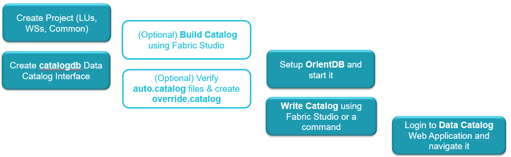

# E2E Catalog Creation Process

This article provides a description of the End to End Process. The details of each step are described in further articles or can be reached via the links.

The following steps should be performed in order to create a Data Catalog from the Fabric project and start using it:

1. Create a new project or use the existing one.
2. Create a [Data Catalog interface](04_data_catalog_interface.md) called **catalogdb**. 
   * This interface is the default Data Catalog interface and it must exist in the project. 
   * If needed, additional Data Catalog interfaces can be defined, for example when having OrientDB cluster.
3. (Optional) Use the [Build Catalog](03_build_and_write_catalog.md) option in the Fabric Studio to build the catalog files for all the project entities (each LU, WS, Common). 
   * This step is optional and only perform if override of catalog files is required prior to the catalog upload to the server.
4. (Optional) [Override the automatic files](06_override_data_catalog.md) to include the elements that don't exist in the project implementation.
5. [Install OrientDB](07_OrientDB_setup) and start it.
6. Use the [Write Catalog](03_build_and_write_catalog.md) option in the Fabric Studio to deploy the Catalog to the server which includes building the catalog files and uploading them to OrientDB. 
7. Logic to the Data Catalog using the K2View Web Framework and [navigate the catalog](05_data_catalog_navigation.md).

 

