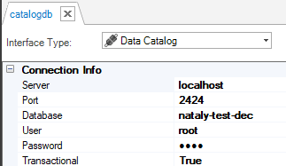

# Data Catalog Interface

To enable Data Catalog in a Fabric project, at least one interface type must be defined as a **Data Catalog**. The name of the default Data Catalog interface must be **catalogdb**. The names of additional interfaces of this type are not restricted to any specific values.

To create a new Data Catalog interface, do the following:

1. Go to **Project Tree** > **Shared Objects**, right click **Interfaces**, select **New Interface** and then select **Data Catalog** from the **Interface Type** dropdown menu to open the **New Interface** window.

   

2. Populate the connection's settings and click **Save**.

#### Connection Settings

<table style="height: 116px;">
<tbody>
<tr style="height: 18px;">
<td style="height: 18px; width: 200px;"><strong>Parameter</strong></td>
<td style="height: 18px; width: 500px;"><strong>Description</strong></td>
</tr>
<tr style="height: 18px;">
<td style="height: 18px; width: 179px;"><strong>Server</strong></td>
<td style="height: 18px; width: 318px;">

IP address of the OrientDB server.

<a href="07_OrientDB_setup.md">Click for more information about OrientDB setup</a>.

</td>
</tr>
<tr style="height: 18px;">
<td style="height: 18px; width: 179px;"><strong>Port</strong></td>
<td style="height: 18px; width: 318px;">Port of the OrientDB server.</td>
</tr>
<tr style="height: 28px;">
<td style="width: 179px; height: 28px;"><strong>Database</strong></td>
<td style="width: 318px; height: 28px;">

OrientDB database name. Enter the name of an existing / new OrientDB database.

If a new name is entered, the new OrientDB database is created during Write Catalog.

</td>
</tr>
<tr style="height: 18px;">
<td style="height: 18px; width: 179px;"><strong>User</strong></td>
<td style="height: 18px; width: 318px;">Username.</td>
</tr>
<tr style="height: 16px;">
<td style="height: 16px; width: 179px;"><strong>Password</strong></td>
<td style="height: 16px; width: 318px;">Password.</td>
</tr>
<tr>
<td style="width: 179px;"><strong>Transactional</strong></td>
<td style="width: 318px;">False (default) or True. Using the transactional interface synchronizes the Catalog Write executions in parallel, which will be used in a multi Fabric clusters with a single catalog DB instance.</td>
</tr>
</tbody>
</table>

 
