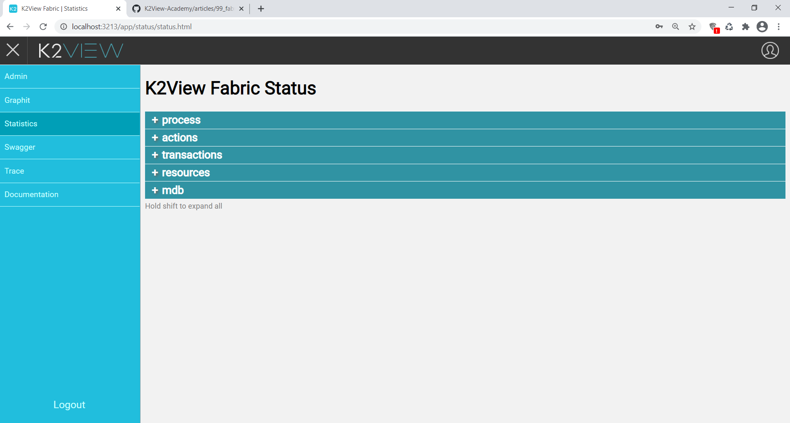

# JMX Fabric Statistics

Fabric exposes runtime and application telemetry through JMX MBeans. This data is available in two distinct ways, which serve different purposes:

- **The Fabric Statistics page** — an in-product UI view inside the Fabric Admin panel, useful for development and ad-hoc inspection
- **The Prometheus HTTP endpoint** — the production monitoring path, served by the bundled JMX Exporter and consumed by Prometheus, Grafana Agent, or any compatible monitoring platform

Both views draw from the same underlying JMX MBeans. The difference is in how the data is presented and who the intended consumer is.


## 1. The Fabric Statistics Page (Admin Panel)

The Fabric Statistics page provides a live view of JMX statistics inside the Fabric Admin panel. It is intended for development-time inspection and ad-hoc troubleshooting, not for production monitoring.

### Accessing the Statistics Page

To access the Admin panel, click the **Globe** icon on the top left corner of the **Fabric Studio**.

Enter your Admin credentials, then click **Statistics** in the left panel.




The following statistics sections are available:

### Process

Statistics about the loading phase of each component running in the current session.

```
Fabric Launch Sequence
since        56:38:23.041                    Time since the event last occurred
timestamp    2020-12-10 12:34:39.733 UTC     Time this event last occurred
Loading Common Area
since        56:38:23.730                    Time since the event last occurred
timestamp    2020-12-10 12:34:39.045 UTC     Time this event last occurred
```

### Actions

Statistics about project deployments and Fabric commands.

```
Deployment count for a specific LU
count        1                               Number of times this event occurred
total        0:00:00.330                     Accumulated total of this event value
average      0:00:00.330                     Average since process launch
timestamp    2020-12-12 21:12:32.131 UTC     Time this event last occurred
since        0:00:30.648                     Time since the event last occurred
Count of Fabric Commands Executed
count        22
timestamp    2020-12-12 21:13:02.638 UTC
since        0:00:00.141
```

### Transactions

Statistics about Fabric jobs, GET performance, Web Services, LUI queries, and LU population sync.

```
GET Duration
last         0:00:00.408
average      0:00:00.408
count        1
timestamp    2020-12-12 21:12:55.092 UTC
since        0:00:07.689
total        0:00:00.408
Web Services Calls
count        10
total        0:00:04.684
average      0:00:00.468
timestamp    2020-12-12 21:13:02.642 UTC
since        0:00:00.141
```

### Resources

Statistics about general system resources.

```
Number of LU in the system
last         3
timestamp    2020-12-12 21:12:32.131 UTC
since        0:26:17.201
Number of Active Cassandra Sessions
total        1
count        1
timestamp    2020-12-10 12:34:35.294 UTC
since        57:04:14.038
```

### MicroDBs

LUI sync counts, fetch times, and sizes.

```
mdb Cache Count
last         3
timestamp    2020-12-12 21:38:39.802 UTC
since        0:00:09.533
mdb Fetch Bytes
count        3
average      53248 B
total        156 KB
timestamp    2020-12-12 21:38:39.794 UTC
since        0:00:09.544
```

### Broadway

Performance metrics per Flow, Stage, Actor, and Iteration.

```
last         00:06.6
average      00:02.1
count        9
timestamp    2021-05-09 13:45:39.298 UTC
since        52:45.2
total        00:19.1
```


## 2. The Prometheus HTTP Endpoint (Production Monitoring)

For production monitoring, Fabric metrics are consumed through the Prometheus JMX Exporter, which K2view bundles with Fabric. The exporter reads the same JMX MBeans and serves them as a standard Prometheus-format HTTP endpoint.

This is the endpoint that Prometheus, Grafana Agent, and other compatible monitoring platforms scrape. It is the primary metrics path for production environments.

### Endpoint Location

Once the JMX Exporter is enabled, the metrics endpoint is available locally on the Fabric host or inside the Fabric container:

```
http://localhost:7170/metrics     # Fabric JVM and application metrics
http://localhost:7270/metrics     # iid_finder metrics (if iid_finder is running)
```

To verify it is working:

```bash
curl http://localhost:7170/metrics
```

For instructions on enabling the exporter, see [How to Enable the JMX Exporter for Fabric](/articles/34_JMX_statistics/How_to_Enable_the_JMX_Exporter_for_Fabric.md).

### Output Format

The endpoint returns plain text in the Prometheus exposition format. Each metric is represented by three elements:

```
# HELP <metric_name> <description>
# TYPE <metric_name> <type>
<metric_name>{<label>="<value>", ...} <numeric_value>
```

For example:

```
# HELP jvm_memory_bytes_used Used bytes of a given JVM memory area.
# TYPE jvm_memory_bytes_used gauge
jvm_memory_bytes_used{area="heap"} 5.21e+08
jvm_memory_bytes_used{area="nonheap"} 1.23e+08

# HELP fabric_read_total Total number of Fabric reads.
# TYPE fabric_read_total counter
fabric_read_total 4821.0
```

The `# TYPE` line identifies the metric type:

- `gauge` — a value that can go up or down (memory usage, active sessions)
- `counter` — a monotonically increasing count (total reads, total API calls)
- `histogram` — a distribution of observed values with buckets (request durations)
- `summary` — similar to histogram but with quantiles

### Metric Families

The endpoint exposes metrics grouped into families:

| Family prefix | Source             | Example signals                                     |
| ------------- | ------------------ | --------------------------------------------------- |
| `jvm_*`       | JVM runtime        | Memory, GC activity, thread counts, class loading   |
| `fabric_*`    | Fabric application | Reads, writes, API calls, mDB sizes, session counts |
| `tomcat_*`    | Tomcat web layer   | Request throughput, error rates, connector state    |
| `process_*`   | OS process         | CPU time, open file descriptors                     |

### Labels

Each metric line includes labels in curly braces that add dimensional context. For example:

```
fabric_api_calls_total{method="GET", status="200"} 1482.0
fabric_api_calls_total{method="POST", status="200"} 347.0
fabric_api_calls_total{method="POST", status="500"} 12.0
```

Each unique combination of label values produces a distinct time series in Prometheus. This is important for storage planning — a metric with many labels and many unique values can expand into a large number of series. See [How to Control Metric Volume with Filtering and Relabeling](/articles/34_JMX_statistics/How_to_Control_Metric_Volume_with_Filtering_and_Relabeling.md) for guidance on managing this.

### Custom Statistics

Metrics added through Fabric's custom statistics API (`statsCount`, `statsDuration`) also appear in the `/metrics` endpoint output, under the `fabric_custom_*` family. See [JMX Custom Statistics](/articles/34_JMX_statistics/03_JMX_custom.md) for how to add custom metrics to the Fabric JMX surface.

### Further Reading

- [How to Enable the JMX Exporter for Fabric](/articles/34_JMX_statistics/How_to_Enable_the_JMX_Exporter_for_Fabric.md)
- [How to Verify That Fabric Is Exposing Metrics](/articles/34_JMX_statistics/How_to_Verify_That_Fabric_Is_Exposing_Metrics.md)
- [How to Configure the Collection Layer to Scrape Fabric Metrics](/articles/34_JMX_statistics/How_to_Configure_the_Collection_Layer_to_Scrape_Fabric_Metrics.md)
- [How to Control Metric Volume with Filtering and Relabeling](/articles/34_JMX_statistics/How_to_Control_Metric_Volume_with_Filtering_and_Relabeling.md)
