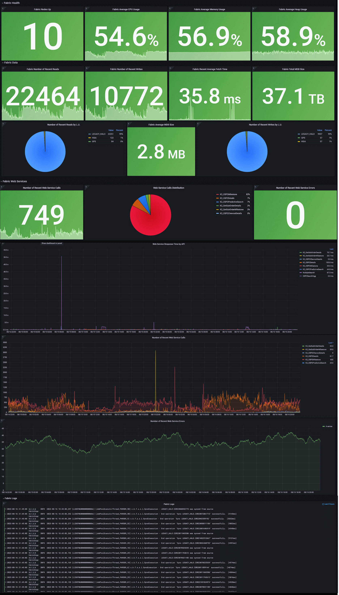

# Monitoring Dashboard Example

The following example illustrates a basic Grafana dashboard configuration for monitoring K2view Fabric alongside supporting components such as Cassandra and Kafka. It is intended as a reference implementation that customers can extend and adapt to meet their specific operational and business requirements by adding relevant, project-specific metrics.

This example assumes a deployment scenario where Fabric, Cassandra, and Kafka are running on bare-metal servers or virtual machines. In cloud-native or Kubernetes-based environments, the source and structure of monitoring data may differ.

You can learn how to set up the dashboard [here](/articles/34_JMX_statistics/05_monitoring_dashboard_example_setup.md), and download the [associated JSON](/articles/34_JMX_statistics/resources/grafana_fabric_all_base_reference.json) configuration for import into Grafana. Each panel in the dashboard includes not only its data source and query, but also descriptive metadata, which is displayed as tooltips in the Grafana UI.

The dashboard is divided into several parts, with several panels that show data of the last 5 minutes (which you can edit):

* **Fabric Health**: Nodes Up, Average CPU Usage, Average Memory Usage, Average Heap Usage
* **Fabric Performance**: Reads Count, Writes Count, Average Read Time, Total mDB Size, Average mDB Size, Writes Count by LU, Total API Calls Count, API Calls Distribution, Failed API Calls Count, API Calls, API Calls Avg. Response Time, API Calls Failures
* **Fabric Logs**
* **Cassandra Health** (in this example, the system DB is Cassandra): Nodes Up, Average CPU Usage, Average Memory Usage, Average Heap Usage
* **Cassandra Performance**: Disk usage, Pending Top 5 Compactions
* **Cassandra Logs**
* **Kafka Health**: Nodes Up, Average CPU Usage, Average Memory Usage, Average Heap Usage
* **Kafka Performance**: Disk usage, Messages per Topic per Second (to avoid clutter, only topics that receive messages are shown)
* **Kafka Logs**

Here is an illustration (names may slightly vary from those stated in the export file):

## Variables

Additionally, a Variables section at the top of the dashboard allows for dynamic filtering—such as by environment (e.g., production, staging)—provided such metadata is present in the collected metrics. These variables can also be customized or hidden via the Grafana UI or JSON configuration. This can be achieved using the Grafana UI (Settings > Variables) or in JSON ('templating' section).

