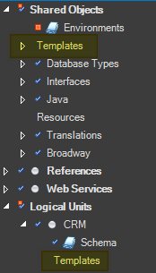

# Creating and Editing Templates

Templates can be created either per LU or can be part of the shared objects. Accordingly they appear at the Fabric studio project tree.



To create a new template:

1. Right click on Templates at the required location in the project tree and choose New Template file.
2. Write the template at the working area. A best practice is to copy an existing object paste it to the working area and edit it as a template.
3. On Save - type in the template name and choose its type among : [Broadway flow](/articles/19_Broadway/02a_broadway_flow_overview.md), [Broadway actor](/articles/19_Broadway/03_broadway_actor.md), [graphit](/articles/15_web_services_and_graphit/17_Graphit/01_graphit_overview.md), java, and [data catalog](/articles/33_data_catalog/01_data_catalog_overview.md) via the Target Ext. drop down list.  

Template file is saved with "template" extension and it appears in the Fabric Studio tree. It is then available for usage when creating later new objects.


To edit a template open it from the Fabric studio project tree. Editing changes take affect on objects that will be created after that. Editing or Deletion of a template do not affect on existing objects. 

 

### Expressions and Helpers

Fabric Templates support the powerful capabilities using [handlebarsjs](https://handlebarsjs.com/) template engine, among them are the expressions and helpers. 

**Expressions** are used as placeholders that can be part of the template and which shall be populated, as input, when creating an object upon.

To embed a simple expression in a template use the ``  syntax, for example:  ``. 

Fabric templates provide two built-in expressions  \_\_LU_NAME and \_\_FILE_NAME, which Fabric populates them, according to the context.

**Helpers** are functions that can be used when creating objects, where some of them - aka built-in helpers - are available as part of the base engine. Such built-in helpers are useful for applying conditions (if-else) and iterations (each) which are embedded in the template.  

Example:

One of the common TDM tasks is to load data from LU into a target DB. For this, a Broadway flows are being used. Having several tables to load, a template is useful whereby it already contains the required stages and actors to fulfil this task, with placeholders to populate LU table as well as target interface, schema and table. 

The DbLoad Actor contains several input fields where in the template they will look like similar to the following:

```json
{
  "name": "interface",
  "const": "{{TARGET_INTERFACE}}"
},
{
  "name": "schema",
  "const": "{{TARGET_SCHEMA}}"
},
{
  "name": "table",
  "const": "{{TARGET_TABLE}}"
}
```

When this template will be used the user shall populate these expressions/placeholders and then the whole flow will be created with all required settings.


[](01_templates_overview.md)[](03_using_templates.md)  

