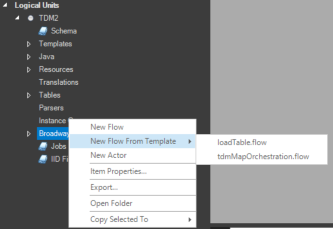
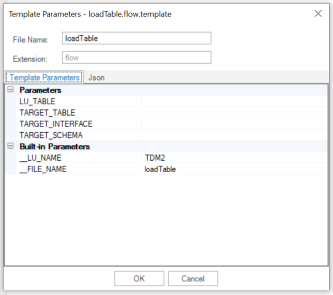

# Using Templates

Once templates are ready at the project, they can be used when creating new objects. [More information about Creating and Editing templates](02_create_and_edit_template.md).

1. At the Fabric Project Tree, right click to create new object.

2. Aside of "New \<object-type\>" option there is an option "New \<object-type\> from Template".

3. Select the required template from the list. Note that the displayed template list is contextual:

   You will see only templates of that object type. For example, if you create a new Java file, then you will see only Java templates.

    You will see only templates which were defined as Shared Objects or those which defined within the LU.

   

4. Populate the expressions/placeholders, if exist for this template, within the opened Template Parameters popup window. This windows contain two tabs which show the same information - one shows it in parameters property view and the other one in JSON view.

   

   Note that in some cases there is a need to define complex input structure which cannot be edited at the property view but only at the JSON view. For example, if the template contains  `{{person.firstname}} {{person.lastname}}` the expected input shall be like the following structure:

   ```json
   {
     person: {
       firstname: "",
       lastname: "",
     },
   }
   ```

   The property view tab will show "person" as "Collection" where editing is enabled at the JSON tab.

  

[](02_create_and_edit_template.md)[](04_advanced_template_capabilities.md)  
