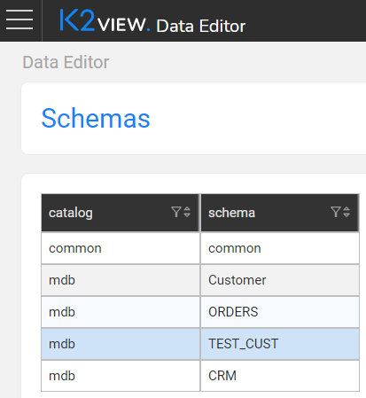

# Data Explorer

Part of the K2View Web Framework, the Data Explorer is a graphical web-based application used to view and edit [LU](/articles/06_LU_tables/01_LU_tables_overview.md) and [reference](/articles/22_reference(commonDB)_tables/01_fabric_commonDB_overview.md) tables and also displays the data structure and relationships between the tables in an LU schema.

### Schemas

When first opened, the Data Editor displays the list of **Schemas** in a table that contains the LUs and common references schemas in the deployed project. Click an entry in the list to navigate to the [Schema Viewer](02_data_editor_schema_viewer.md) screen.

The following is an example of a list of project's Schemas:

###### 

To refresh the table list, click  **Refresh** in the top action bar.

 

