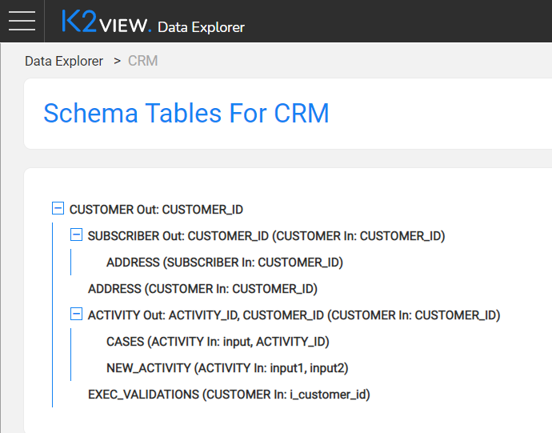
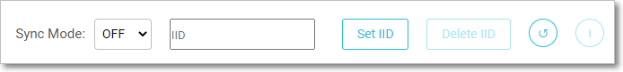
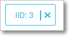

# Data Explorer Schema Viewer
The Schema Viewer opens after a specific LU or common is selected in the Data Explorer Catalog screen. It 
displays a schema's structure and enables fetching its data. Depending on your selection, either of the following is displayed:

### LU Tables

This screen enables viewing the LU schema structure and fetching an LUI of a specific IID. It has two main areas:
- Top Action Bar.
- Schema View.

#### Schema View

The schema's tables are shown in a top-down nested tree, starting from the LU's root table. The schema structure can be viewed via the [Studio LU Scheme Window](/articles/03_logical_units/03_LU_schema_window.md#logical-unit-lu-schema) as well as in the [Data Catalog web app](/articles/33_data_catalog/01_data_catalog_overview.md) which also displays the data flows. 

* Each table has:

  * Input, its predecessor in the hierarchy and their linkage field/s.
  * Output (optional), the linkage field/s to its linked tables. 
  
* Each table links to the table Data Viewer screen.
* The schema name appears in the screen title as well as in the breadcrumbs in the top Data Explorer Catalog bar.  

 Note that a table might appear more than once when there is more than one population stage.

#### Actions Bar

 The first three options in the Actions bar are used to fetch LUI:

* **Sync Mode**, select between **Off** or **On**. **Force** is not exposed in the Data Explorer app. The data is then fetched according to [Sync Behavior](/articles/14_sync_LU_instance/10_sync_behavior_summary.md#sync-behavior---summary-table) rules.

* **IID** text field, where the LU IID are populated.

* **Use IID** that activates LUI data retrieval. Once an LUI is retrieved its value is shown on the top, in an input chip form, and is also displayed as breadcrumbs when drilling down the tree. 
  
    
  
  * An error message is displayed when an LUI is not found.

Note that you can drill down the tree also when an IID has not been defined and set it later at any level. When the LUI is fetched, data from its level is displayed. 

Other available actions include:

* **Reset**, click the X on the IID chip to reset the LUI. 
* **Delete IID**, click to unload the LUI from Fabric. This option is enabled when the LUI is fetched and is otherwise disabled and grayed-out.
* **Refresh**, click to refresh the retrieved data.
* **Info**, click to display the sync information: when this data was synced and when it is going to be synced next, according to [Sync Behavior](/articles/14_sync_LU_instance/10_sync_behavior_summary.md#sync-behavior---summary-table) rules. This option is enabled only when an LUI is fetched and is otherwise disabled and grayed-out.

### Reference / Common Tables 

This screen displays the common tables list. Click an entry in the list to navigate to the table Data Viewer screen.

 
