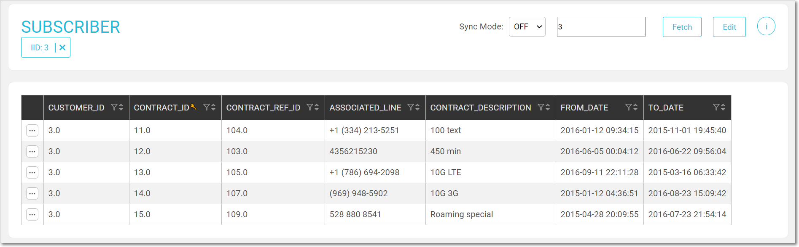
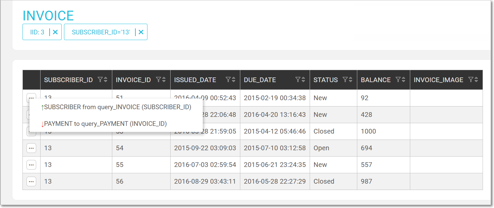

# Table Data Explorer

Information in the Data Explorer is displayed in a table and can be edited, added, updated and deleted using the functions displayed in the top Actions bar.  

### Actions Bar

<table style="border-collapse: collapse; width: 100%;" border="1">
<tbody>
<tr>
<td style="width: 12.4762%; height: 17px;">Fetch</td>
<td style="width: 87.5238%; height: 17px;">Click to fetch data for the IID.</td>
</tr>
<tr >
<td style="width: 12.4762%; height: 17px;">Info</td>
<td style="width: 87.5238%; height: 17px;">Click to display the synced data.&nbsp;</td>
</tr>
<tr >
<td style="width: 12.4762%; height: 17px;">Edit</td>
<td style="width: 87.5238%; height: 17px;">Click to switch to Edit mode.</td>
</tr>
<tr>
<td style="width: 12.4762%; height: 17px;">Export</td>
<td style="width: 87.5238%; height: 17px;">Click to export the LUI data in CSV format.</td>
</tr>
<tr>
<td style="width: 12.4762%; height: 17px;">IID X</td>
<td style="width: 87.5238%; height: 17px;">Click to reset the LUI.</td>
</tr>
</tbody>  
</table> 

To fetch data, select the [sync-mode](/articles/14_sync_LU_instance/02_sync_modes.md), enter the **IID** and click **Fetch**.

### Table Data

A table displays data which can be filtered, sorted and navigated. Click the to display the data's predecessor, descendants and its connections in the hierarchy.

In the following CASES table, a customer LUI has several activities each having a case. The data has been filtered to display the cases for ACTIVITY_ID = 530:   

   

Note that a table displays the first 1000 entries.

#### Table Edit Mode 

The Editing option is permissions based.
1.  To edit the table's content, click **Edit** to switch to Edit mode:  
    -  New rows are automatically added at the top of the table.
    -  Clickto remove a table entry.
    

    Once an entry is added, edited or marked for deletion it is highlighted: 

    -  New = blue.
    -  Edited = orange.
    -  Deleted = red. 

2.  To undo your changes, click .
3.  To apply the changes, click **Update** in the top Actions bar.

 

