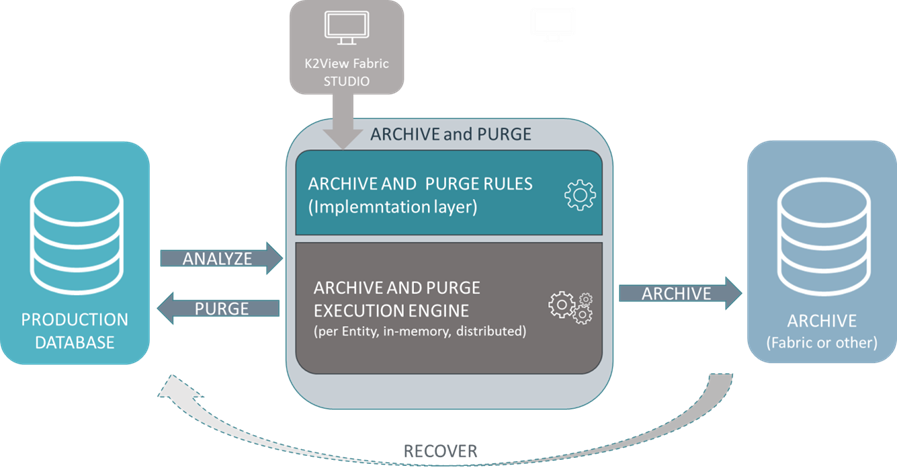

# Data Purging #

Purging data from a database is an important task, which must be undertaken from time to time for a variety of reasons: confidentiality, security, contractual obligations, saving of space, etc.

Fabric provides a solution for implementing a purge process that is secure and can be implemented in an on-going manner. The purge process can also function as an archiving process, allowing Fabric or an external data base to function as the archival repository. Since Fabric works with Logical Units, complex purging rules can be created and implemented without impacting performance. 

The purge process is designed using the Fabric Studio user interface, which eliminates the need to perform coding tasks, as the purge can be done by implementation only.

This purge solution also allows simple testing and validations, as the process populates detailed reporting tables of the purged entities and the logic that led to purging or not purging a specific database entry.

Fabric uses a Logical Unit in order to search the application database for data that should be purged. This Logical Unit - specially designed for the purging process - enables the purging to be undertaken as one transaction, after the user has assessed the full picture of the purging needs.  

This Logical Unit-based purging process provides significant advantages, such as:

- Assuring that the purge will never affect the data integrity in your database, as for each such unit the deletion of data will only be done if it was successful across all the Logical Unit entities

- Allowing complex logic to be used to qualify data for purging. This logic is applied in each transaction on the data of the specific LU only, which means that only a small data volume is queried.

- Breaking the purging process down into small chunks and running it on a regular basis. 

If archiving of the data should be performed as well, it can be performed immediately before the purge of a specific unit, and the purge will only be done if the archive was completed successfully for this unit. The archive repository can be either Fabric itself or an alternative data repository.

Implementing a Purging project can be divided to the following macro steps: 

- **Define the purging rules** that should be applied in order to decide what data qualifies for purging
  
- **Define the logical unit (LU)** that will be the basis for the purge

- **Implement the logical unit structure and the purging logic** as a Fabric project, using the functions and capabilities of its Purging Library.

Once those steps are completed, the process is ready for deployment and execution.

