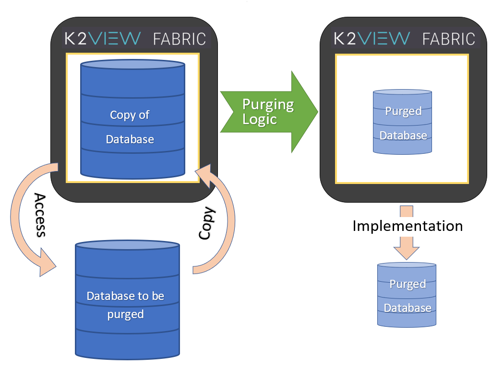

# Data Purging Overview #

Purging data from a database is an important task, which must be undertaken from time to time for a variety of reasons: confidentiality, security, contractual obligations, saving of space, etc.

Fabric provides a solution for implementing a purge process that is secure and can be implemented in an on-going manner. The purge process can also function as an archiving process, allowing Fabric or an external data base to function as the archival repository. Complex purging rules can be created and implemented without impacting performance. 

The purge process is designed using the Fabric Studio user interface, which eliminates the need to perform coding tasks.

Purging using Fabric works as follows: 

- Fabric accesses the database to be purged, and makes a copy of it in Fabric. 
- Fabric then uses its strong database manipulation capabilities to implement the purging logic as defined by the user.  
- Once the purging process is ready, Fabric then implements the purge on the original database. 

The Fabric-based purging process provides significant advantages, such as:

- Assuring that the purge will never affect the data integrity in your database, as for each such unit the deletion of data will only be done if it was successful.

- Allowing complex logic to be used to qualify data for purging. This logic is applied in each transaction on the data of a specific subsection of the data in the database, according to user definitions. 

- Breaking the purging process down into small chunks and running it on a regular basis. 

The Fabric purge solution also allows simple testing and validations, as the process populates detailed reporting tables of the purged entities and the logic that led to purging or not purging a specific database entry.

If archiving of the data should be performed as well, it can be performed immediately before the purge of a specific unit, and the purge will only be done if the archive was completed successfully for this unit. The archive repository can be either Fabric itself or an alternative data repository.

