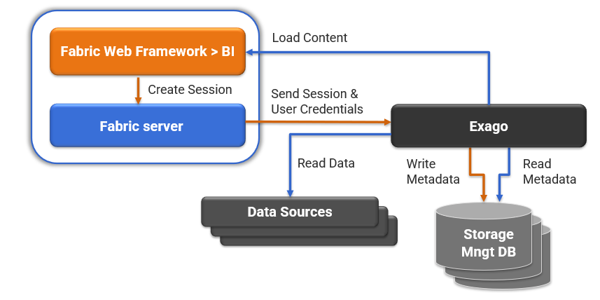

# BI User Guide 

### Overview

Fabric provides a built-in integration with [Exago BI](https://support.exagoinc.com/hc/en-us) - an external Business Intelligence (BI) system that enables the design and execution of reports and dashboards. The integration architecture is described in the following diagram:

The BI application can be accessed via the [K2View Web Framework](https://support.k2view.com/Academy_6.5/articles/30_web_framework/01_web_framework_overview.html) and it includes the following modules:

* **BI Admin** - system configuration and initial setup module which allows to: 

  - Create data sources and define their metadata (objects and joins).
  - Create parameters for applying a filter within the reports.
  - Update various system configurations (advanced).

  The access to this module is restricted based on Fabric user role.

* **BI Designer** - creation and generation of various types of reports and dashboards. 

Note that the reports can also be invoked from Fabric user code. The way to do it is described in this User guide.

### E2E BI Setup and Execution

In order to create and execute the reports, start from the following setup steps in **BI Admin**:

* [Installation and Storage Management setup](01_Installation.md).
* [Access rules and permissions settings](02_Permissions_Setup.md).
* [Metadata setup](03_Metadata_Setup).
* [Parameters definition](04_parameters.md).

Then you can work on the reports using the **BI Designer**:

* [Reports creation guidelines](05_report_creation_guidelines.md).

When the report is created, tested and ready for execution, it can be invoked from the Fabric user code using a Fabric JOB framework. This can be done using a JOBTYPE = GENERATE_BI:

* [Reports execution guidelines](06_report_execution_guidelines.md). 

 
