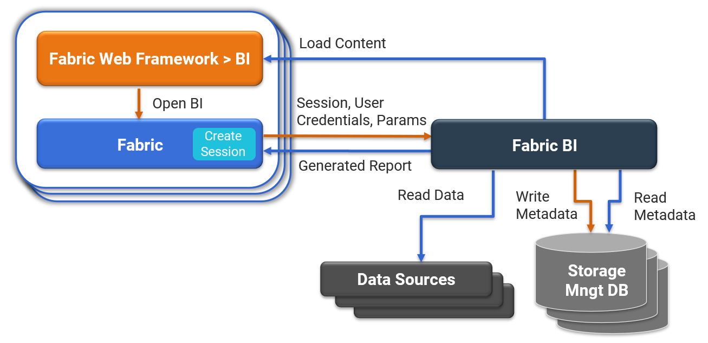

# BI Architecture Overview

Starting with release V6.5.3, Fabric includes a business intelligence application called **BI**. Fabric's BI enables the design and execution of reports and dashboards, and can connect to various data sources to read the data. The reports metadata is kept in an external Storage Management database. The BI serves as a pipeline between the data sources and the generated reports.

The BI architecture is described in the following diagram:

 

Fabric BI is implemented using ExagoBI, which is included in Fabric's license. However, a separate installation and configuration is required as described at this [link](01_Installation.md). 

The BI application is embedded into the [K2View Web Framework](/articles/30_web_framework/01_web_framework_overview.html) and includes the two modules:

* **Admin** - system configuration and initial setup module which enables the user to do the following: 

  - Create data sources and define their metadata (objects and joins).
  - Create parameters for applying a filter within reports.
  - Update various system configurations (advanced).

  Access to Admin is restricted based on the Fabric user role. The explanation about how to control access and define user roles is described at this [link](02_Permissions_Setup.md).

* **Designer** - content creation module which enables the user to do the following:

  * Create various types of reports and dashboards. 
  * Generate the reports / dashboards and download the extract files.

The certified data sources types that can be used for reports are:

* Fabric Common and MicroDB.
* PostgreSQL, Oracle.
* Fabric commands (custom SQL).
* Combination of the above (join).

Reports can be generated by one of the following: 

* Manually by a user via the BI Designer.
* [Using a deep link](06_report_execution_guidelines.md#reports-generation-using-deep-link).
* [Using the Fabric Job mechanism](06_report_execution_guidelines.md#reports-generation-using-the-fabric-jobs-mechanism). 

Continue to the next articles of this user guide to get more details about each step of BI setup and implementation.

 
