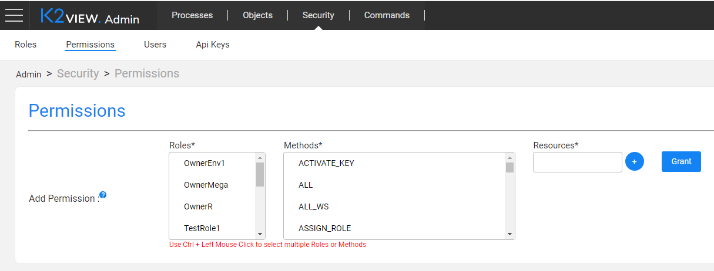

# Access Permissions Setup

### Overview

Fabric users who want to implemenet the business intelligence capabilities of Fabric can be divided into two groups: those who can setup and create the BI reports and those who can only run them. In order to enforce this differentiation, Fabric introduces the permission setup process divided into two steps:

1. Assign the **BI_ADMIN** permission to designated Fabric roles via the Fabric Admin application. In the Fabric Admin app, use the [roles and permissions](/articles/17_fabric_credentials/01_fabric_credentials_overview.md) authorization mechanism.
2. Setup the access rules in Exago by using the Exago BI built-in access permissions mechanism to control the activities such as Edit, View, Delete within the BI Designer. 

The rest of this article explains how to setup different levels of access in BI Designer, based on the combination of Fabric credentials and Exago access rules.

### Fabric Role Permissions 

Fabric provides the ability to access the **BI Admin** within the BI application in the Web Framework in order to:
* Create data sources and define their metadata (objects and joins),
* Create parameters for applying a filter within the reports,
* Update various system configurations (advanced),
* Create new reports within the **BI Designer**.

The **BI_ADMIN** permission is introduced in order to give access to the above features to specified user roles.

**How Do I Set Permissions in Fabric?**

Setup the **BI_ADMIN** permission in the Web Framework by clicking **Grant Permissions** in Admin > Security > Permissions:

### Access Rules Within BI

Exago access rules are defined in the Storage Management DB, per each folder (and report - if it differs from the folder access).

When the Fabric project is deployed, the <project name> folder is created in BI Designer and the default read-only access rule is assigned to all user roles in this folder.

To define the specific access rules (e.g. Can View, Can Copy, Can Rename) per Fabric role, run the Fabric command **set_bi_access**.

**Note:**

- If the user that is logged into BI Designer is not assigned any access rules, he will get a read-only access to Exago folders and reports.
- If the logged user is an owner of a folder or a report, he will have full access to it even if no specific access rules were assigned to his role on the folder/report.

**How Do I Set Access Rules?**

Exago Storage Management is a DB that keeps the definition of all reports, templates, folders and themes. It also keeps the access rules to folders and reports, using the Content Permissions model based on 4 basic identity keys.

[Click for more information about Exago Identity Keys](https://support.exagoinc.com/hc/en-us/articles/360042587313#h_2ffb7d21-1f58-47bd-957d-55a4eace7ef0).

To define the access rules, run the Fabric command **set_bi_access** with the following input:

1. Folder name or report name (optional), if not provided the command is executed on the <project name> folder.
2. Fabric role (mandatory).
3. Array of access flags (mandatory), provide only those that should be **true**: 
   * CanEdit
   * CanRename
   * CanShare
   * CanDelete
   * CanCopy
   * CanMove
   * CanSchedule (placeholder, will be supported in later versions)
   * CanCopy

The command will either create the permissions in the Storage Management DB or update the existing permissions.

 

