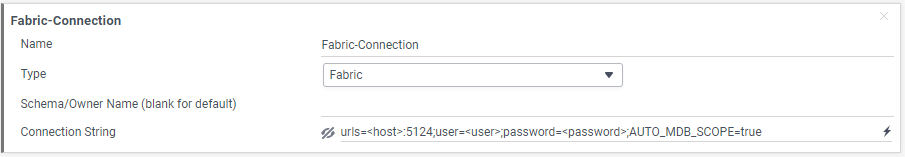
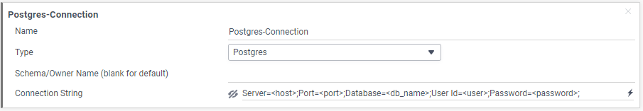
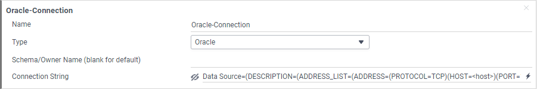
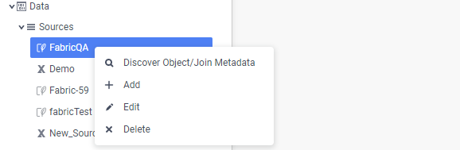
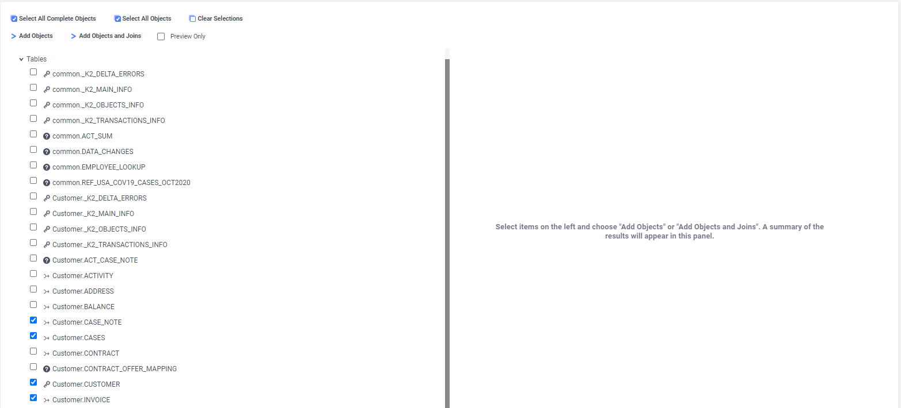
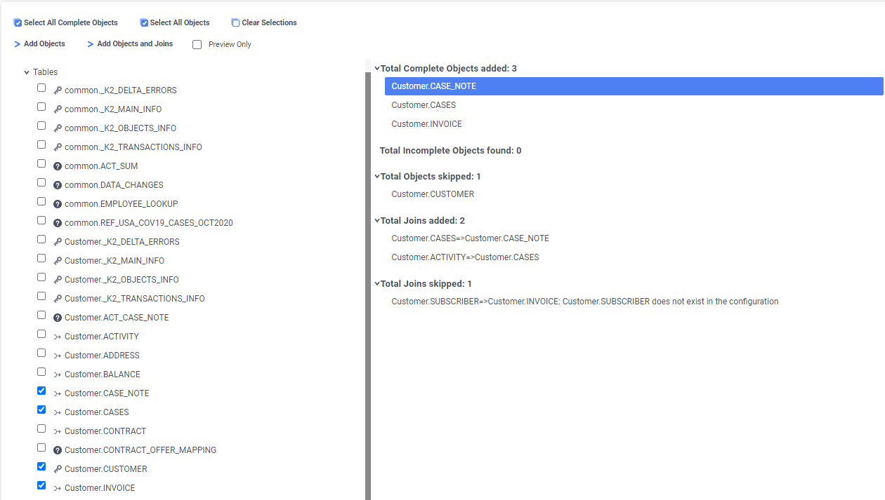
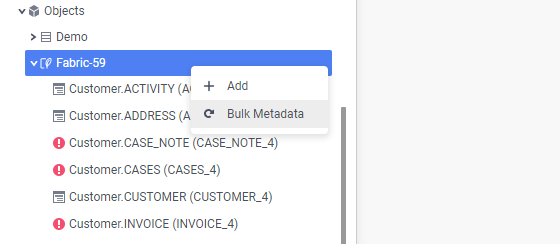
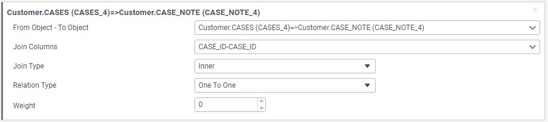

# Metadata Setup

### Overview

To start creating business intelligence reports, you must set up the metadata by defining the data sources, then its objects and joins in the **Admin** module of the BI application. This article explains how to do these tasks: 

* Creation of [Data sources](03_Metadata_Setup.md#data-sources).
* Creation of [Objects and Joins](03_Metadata_Setup.md#objects-and-joins). 

Note that each **data source** defined in the **Admin** module must have a corresponding **interface** in Fabric with the same name.

### Defining Data Sources

The following data sources types are supported:

* Fabric
* PostgreSQL
* Oracle

See below the detailed explanation how to define each one of the above data source types.

**How Do I Define Fabric as a Data Source?**

Fabric itself can be defined as a data source to allow creation of the reports based on Common or LUI data.

To set up Fabric as a data source, use the Fabric-Connection template in the **Admin** module as follows:

1. Double click on **Sources** in the Report Tree and set the following:

   

   * Name - a unique name.
   * Type - select **Fabric**.
   * Connection String - define as follows:

  ~~~
  urls=<host>:<port>;user=<user>;password=<password>;AUTO_MDB_SCOPE=true
  ~~~

2. Click **Apply** to save the changes.

If BI is running on a docker, it can be connected to a local Fabric. In this case, set the **IPv4 Address** of your internet connection (by checking your machine's IP address) as a host in the Connection String.

**Note**: 

* One BI installation can accommodate several Fabric deployments by defining each deployment as a separate data source.  
* Setting **AUTO_MDB_SCOPE=true** in a Fabric connection string is mandatory since it enables the implicit invocation of the Fabric GET command and allows querying the Logical Unit's data. [Click to get more information about AUTO_MDB_SCOPE setting.](/articles/02_fabric_architecture/04_fabric_commands.html)

**How Do I Define PostgreSQL DB as a Data Source?**

To set up a PostgreSQL database as a data source, use the Postgres-Connection template in the **Admin** module and update the connection string:

**How Do I Define Oracle DB as a Data Source?**

To set up an Oracle database as a data source, use the Oracle-Connection template in the **Admin** module and update the connection string:

### Objects and Joins

Once the data source is created, you must define its objects and joins. Objects and joins can be created either manually one by one or automatically via the Discover Object/Join Metadata function.  

**How Do I Initiate Automatic Metadata Discovery?**

1. Make sure you are accessing the **Admin** module, by clicking the **Admin** tab in the upper right section of the user interface. 
 
2. Once you are in the **Admin** module, right click the <Data Source Name> under **Sources**, then click **Discover Object/Join Metadata** to initiate the automatic discovery:

   

3. When the **Discover Object/Join Metadata** screen opens, the list of all Fabric tables is displayed. 
   It includes the Common area tables and all the tables of all Logical Units.
   
4. Select the tables required for report creation, then click **Add Objects and Joins** to create objects and joins in BI.

   

5. When the objects and joins creation is done, the list of created / skipped objects and joins is displayed on the right side of the screen.

   

   * **Complete** objects are the objects which were created successfully in BI.
   * **Skipped** objects are the objects which were skipped for any reason (for example if they already exist in BI).
   * **Incomplete** objects are the objects which don't have a primary key in the data source. Since a primary key is mandatory in BI, you must open these objects and manually define their **Unique Key Fields**.

6. All new objects are created without their metadata. They are marked withicon. You must complete the object's metadata by doing one of the following:

   * Right click on the data source name, then select > **Bulk Metadata** to create each object's metadata within BI: 

   

     Or 

   * Open each object and click the icon in the **Column Metadata** field > **Read Schema** > **Okay**.

7. Verify the default settings of each new join:

   * Check the **Join Columns** and update if needed.
   * By default, **Join Type** = Inner and **Relation Type** = One To One. Update these settings to reflect the actual join and relation types.

   

**Important Notes to Help Creating Successful Metadata**

* If a table doesn’t have a primary key defined in Fabric, the object is created as **Incomplete** by the auto discovery process. In this case, you must set up the primary key manually. The LU's Root Table must have a primary key defined in a Fabric LU schema. 
* The joins between incomplete tables are not created by the auto discovery process and must be created manually.
* It is not required to define all data source's objects and joins in BI, but only those which are required for reports creation. However the LU's **Root table** and its respective joins must always be included in the data source metadata definition, even if it is not required for the report creation. [Click to get more details about the report creation based on Fabric LU tables](04_report_creation_guidelines.md).
* To include data across several data sources in the same report (for example, the data from Fabric and from PostgreSQL DB), you must manually create a join between the respective objects of these data sources. The same should be done when you need to include the LU and common tables data of the same Fabric in the report (since Fabric doesn't have a foreign key relation between the LU and common tables). 

[Click for more information about automatic database discovery in BI (ExagoBI)](https://exagobi.com/support/administrators/installation-and-configuration/automatic-database-discovery/).

