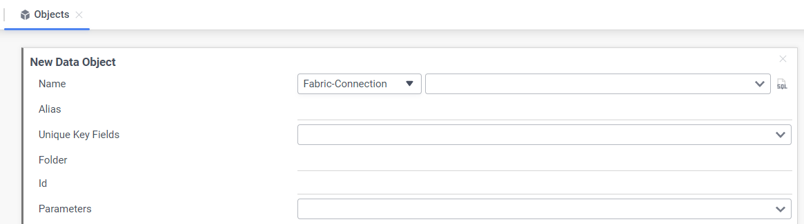

# Report Creation Guidelines

### Overview

This article describes several important guidelines for creating reports with the BI application. It requires working with both the **Admin** module, and the **Designer** module of BI, and as such, can only be carried out by users with BI_ADMIN privileges.

### Creating Reports Based on Fabric LU Tables

One of the basic reports is a report based on data from a Fabric LU Instance. Follow these steps to create such report:

1. Open the **Admin** module (click on the Admin tab in the upper left) to do these tasks:

   * Create the Fabric data source and define its objects and joins, as explained step-by-step in the [Metadata Setup](03_Metadata_Setup.md) article. 
   * Create the parameter(s) to be used by the filter, as explained in the [Parameters](04_parameters.md) article.
2. Open the **Fabric Studio** and define the Interfaces with the same name as the data sources that you created in the Admin module (optional). 
3. Open the **Designer** module (click on the Designer tab in the upper left).  
4. Click the  icon to trigger creation of a new report.
5. Select the report type. For example **Advanced Report**. 
6. Select the data objects for the report. Note the following:
   * The list of data objects presents a list of all existing data objects under all defined data sources. 
   * Once the first data object is selected, most of the objects are disabled except for those that have a join with the selected object.
   * Start the selection from the LU Root table and down to the required tables, based on the LU Schema relations. 
7. Once the data objects are selected, click the icon to set the filter by IID as follows:

8. Once the filter is set, click **Okay**. 

### Creating Reports Based on Custom SQL

Sometimes the report data requires writing a complex SQL query rather then just selecting columns from several joined tables. This is supported by a Customer SQL Object screen.

Creating a report based on a custom query is similar to creating it based on Fabric LUI tables.  Click the  icon to trigger the new report creation and then instead of selecting the data objects, click theicon to write the custom query using the Custom SQL Object screen:

Since this SQL is executed on an LUI, it must also include a filter by LU Instance ID. For example:

~~~sql
SELECT TE.source_id, TE.target_id, tasks.be_name, task_execution.task_execution_id, 'Copied' as status
FROM (select distinct entity_id as source_id, target_entity_id as target_id
		from task_execution_link_entities
		where parent_entity_id = '' and execution_status = 'completed'
		except
	  select entity_id as source_id, target_entity_id as target_id
		from task_execution_link_entities
		where parent_entity_id = '' and execution_status <> 'completed') TE, tasks, task_execution
WHERE task_execution.task_execution_id = '@task_execution_id@'
~~~

The IID value can be provided using a parameter which is created in the **Admin** module and set either in **Admin** or programmatically via the REST API call. See more at [Reports execution guidelines](06_report_execution_guidelines.md). 

An alternative way to create a custom SQL object is via the **Admin** module as follows:

1. Open the **Admin** module.

2. Right click **Objects > Add**.

   

3. Click **SQL** icon on the right side of the **Name** field to write the custom query using the Custom SQL Object screen.

When a custom SQL is created in the **Admin** module, you can create a join between this object and other existing objects.

### Creating Reports Based on Fabric Commands

When you need to create a report based on the Fabric Command results, it can be done using the Custom SQL Object screen. 

Click the  icon to trigger the new report creation and then instead of selecting the data objects, click theicon to write the custom query using the Custom SQL Object screen. Use the syntax as shown below:

~~~sql
select * from k2_fabric_command_sql where command='<command>'
~~~

**Example of a report of Fabric command without parameters:**

~~~sql
select * from k2_fabric_command_sql where command='test_connection'
~~~

**Example of a report of Fabric command with parameters:**

~~~sql
select * from k2_fabric_command_sql where command='batch_list status="@status_name@";'
~~~

Where **status_name** is a session parameter.

