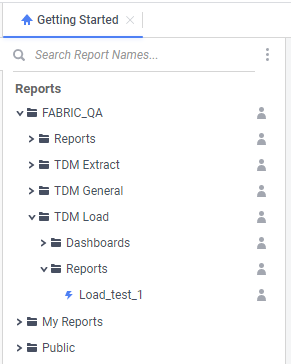

# Report Execution Guidelines

Fabric BI reports are created and executed using the **BI Designer** module. Generation of a report without opening the Fabric BI application can be done by the  **GetExecute** REST API.

The [Fabric Jobs mechanism](/articles/20_jobs_and_batch_services/01_fabric_jobs_overview.md) enables generation of Fabric BI reports via Fabric user code so they can be scheduled and can benefit from Jobs execution parameters. 

The sections below explain both options.

### Reports Generation using BI Designer

Generate the report in the **BI Designer** module using the  icon in the Report Tree or the Run  button in the report editor. 

You can setup various report generation options using the Report Options (applicable for Advance Reports). 

### Reports Generation using the Fabric Jobs Mechanism

Generate the report using the [STARTJOB command](/articles/20_jobs_and_batch_services/07_jobs_commands.md). Set the Job parameters as follows:

* Use the **GENERATE_BI** as the job type.

* Set the **NAME** to be the full path from the root folder to the report. In the below example, the NAME is 'FABRIC_QA/TDM Load/Reports/Load_test_1'.

  

* The following **ARGS** should be passed:
  * **OUTPUT_NAME** - extract file name. For example, you can concatenate parameters such as IID or datetime to the original report name or even provide a completely different name for the extract file.
  * **TYPE** - export file format can be one of the following valid formats: html, csv, pdf, rtf, excel, json.
  * **DESTINATION** - the name of the Fabric interface where the export file should be placed. It can be either a Local File System or an SFTP interface type.
  * **DATA_SOURCES_LIST** - array of the Fabric interface names that should correspond with the  report's data sources defined for this report. [Click to get more details about the data source definition](03_Metadata_Setup.md#data-sources).
  * **SESSION_PARAMS** - array of the session parameters used by the report. Only the **Id** (name) and the **Value** attributes of the parameter are mandatory. The other attributes (such as Type) are optional. [Click to get more details about the parameters definition](04_parameters.md).

* The following are optional **ARGS**:

  * **FILTER** (optional) - parameters to filter the report's results. Note that this is a run-time filter and it is <u>not</u> related to the built-in filter which is added as part of report creation. Only the **FilterText** (the value of the filter) is required, the other attributes are optional.
  * **SORT** (optional) - parameters to sort the report's results. Note that this is a run-time sort and it is <u>not</u> related to the built-in sort which is added as part of report creation.  The fields **EntityName** and **ColumnName** (data object and column to sort on) are required.

  ​

Note that **SESSION_PARAMS** is an optional parameter for REST API invocation. However all reports based on Fabric LU data require at least one session parameter definition - to pass the IID for the GET INSTANCE command.

**Example of GENERATE_BI Job:**

~~~bash
startjob GENERATE_BI NAME='FABRIC_QA/TDM Load/Reports/Load_test_1' ARGS='{"OUTPUT_NAME":" Load_test_TaskID_12345_ExecutionDate_20212309", "DATA_SOURCES_LIST":"[{\"Name\": \"Fabric-PROD-V1\"}]", "TYPE":"csv", "DESTINATION":"MyLocalFS", "SESSION_PARAMS": "[{\"Id\": \"task_execution_id\",  \"Value\": \"70\"}, {\"Id\": \"lu_name\", \"DataType\": \"String\", \"Value\": \"CRM_LU\", \"IsHidden\" : false}]"}';
~~~

[Click to get more information about the Fabric BI (ExagoBI) GetExecute REST API](https://support.exagoinc.com/hc/en-us/articles/115003313988).

