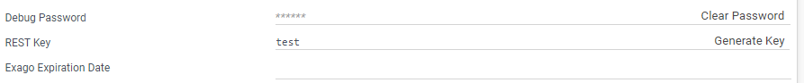
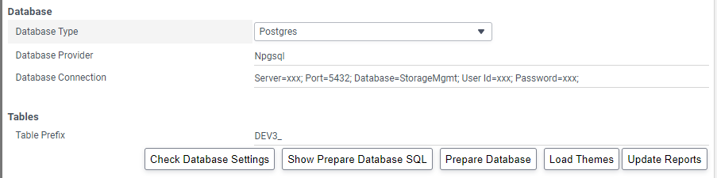

# BI Admin Configuration

The **BI Admin** module (Administration Console) enables you to configure the Fabric BI application including the security, database, UI and other various settings. **WebReports.XML** is the main Fabric BI configuration file which stores these settings. Any change applied on the **BI Admin** module is reflected in the WebReports.XML file.

Note that WebReports.XML does not keep the default flag values. That is, if the default value of a flag is True, the flag only appears in WebReports.XML when its value is changed to False. 

During the Fabric BI application installation, the pre-configured WebReports.XML is copied to your server and it serves the Fabric BI integration. 

This article describes the configurations which exist in WebReports.XML and are required for Fabric BI integration as well as other important settings.

### Allow Direct Access

The Fabric BI application can either be invoked directly via a URL or by the REST call from the hosting application. As part of the Fabric BI integration solution, the Fabric BI application must be invoked by the REST call only in order to secure the access to the business intelligence data. Thus the following flag must be set to **False** in the **BI Admin** module by selecting **General** > **Main Settings**:

This is how this flag is defined in WebReports.XML:

~~~xml
<allowhomedirect>False</allowhomedirect>
~~~

In demo or development environments, you can change this setting to **True** if it is needed to temporarily access the Fabric BI application directly via the URL. Note that this is not acceptable for production environments. 

### REST Key

The REST Key is used to authenticate REST requests from the Fabric server to Fabric BI. The REST Key is defined in the **BI Admin** and it is set to the default value during the BI installation.

To update the REST Key do the following:

1. Open the **BI Admin** module, then select  **General** > **Other Settings** and either populate the REST Key manually or click **Generate Key**:

   

2. Click **Apply** to save the updated REST Key.

3. Copy the value of the REST Key to the **BI_REST_KEY** parameter of **config.ini** on your Fabric server.

### Allow New Root Directories

By default, the **BI Designer** allows you to create several root folders using the **Add Folder** link:

In order to enforce the access rules on the project level, this ability is disabled by setting the following flag to False in the **BI Admin** module by selecting **General** > **Feature/UI Settings**:

This is how this flag is defined in WebReports.XML:

~~~xml
<allowreporttreerootaccess>False</allowreporttreerootaccess>
~~~

Upon the project first deployment, the <project name> folder is created automatically as described [here](01_Installation.md#Project-Initialization-in-BI). The user can still create child folders under this folder, if he has either **Unrestricted** or **CreateContent** access levels.

### Fabric BI User Roles 

Fabric BI user roles are created to specify how a user or group of users interfaces with Fabric BI. Roles can restrict access to folders or data objects.

The main reason for using roles is the ability to restrict or allow the creation of reports. Two roles are pre-configured in the **BI Admin** module and must be present in WebReports.XML:

* **create_report** role, which allows the creation of several kinds of reports in the **BI Designer** module.
* **default** role, which does not allow creation of reports.

The Fabric user roles with that have the **BI_ADMIN** permission level are automatically assigned the **create_report** role, thus these users are allowed to create reports.

### Storage Management Initialization

When a PostgreSQL DB is installed, a Storage Management schema must be initialized. It includes creation of specific metadata and data. 

As part of the Fabric BI integration, Storage Management initialization is performed automatically upon the deployment of the project. However when working on the Fabric BI application directly, the following steps must be performed:

1. Open the **BI Admin** module, then select **Storage Management** and populate the **Database** connection parameters. Note that these are the same parameters as defined in config.ini.
2. If the same Storage Management DB must be reused for several business intelligence environments, indicate a table prefix. It also should align with the table prefix defined in config.ini.
3. Click **Show Prepare Database SQL** to view the queries to be executed on the Storage Management DB.
4. Click **Prepare Database** to run the queries on the Storage Management DB.

Note that it is not needed to perform the initialization process when using the default SQLite Storage Management DB.
