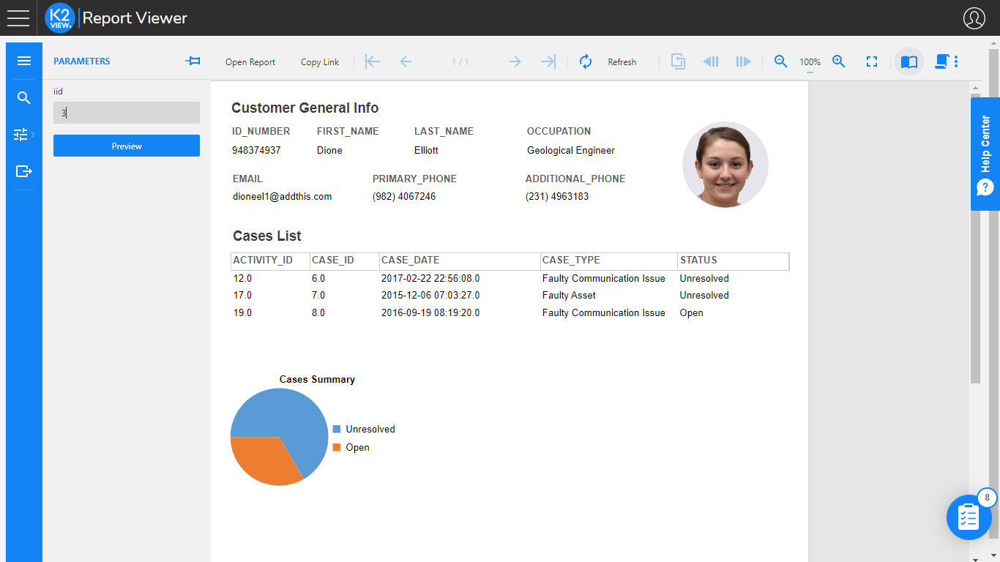

# Reports Overview

Starting with V7.1, Fabric includes a **Reports** application which enables building interactive pixel-perfect reports using the Designer and Viewer components. The application supports data binding to a wide variety of JSON data sources by providing flexible connection configuration at design time and rich API for advanced use-cases.

Fabric Reports is implemented using ActiveReportsJS by GrapeCity, and is included in Fabric's license and Fabric installation package. No separate installation or configuration is required. All the Fabric Reports components operate in a web-browser environment. They are embedded into the [K2View Web Framework](/articles/30_web_framework/01_web_framework_overview.html).  

-------------------------------------------------------------------------------------------------------------------------------------

The BI application is embedded into the [K2View Web Framework](/articles/30_web_framework/01_web_framework_overview.html) and includes the two modules:

* **Admin** - system configuration and initial setup module which enables the user to do the following: 

  - Create data sources and define their metadata (objects and joins).
  - Create parameters for applying a filter within reports.
  - Update various system configurations (advanced).

  Access to Admin is restricted based on the Fabric user role. The explanation about how to control access and define user roles is described at this [link](02_Permissions_Setup.md).

* **Designer** - content creation module which enables the user to do the following:

  * Create various types of reports and dashboards. 
  * Generate the reports / dashboards and download the extract files.

The certified data sources types that can be used for reports are:

* Fabric Common and MicroDB.
* PostgreSQL, Oracle.
* Fabric commands (custom SQL).
* Combination of the above (join).

Reports can be generated by one of the following: 

* Manually by a user via the Reports Designer.
* [Using a deep link](06_report_execution_guidelines.md#reports-generation-using-deep-link).

Continue to the next articles of this user guide to get more details about each step of reports setup and implementation.

 
