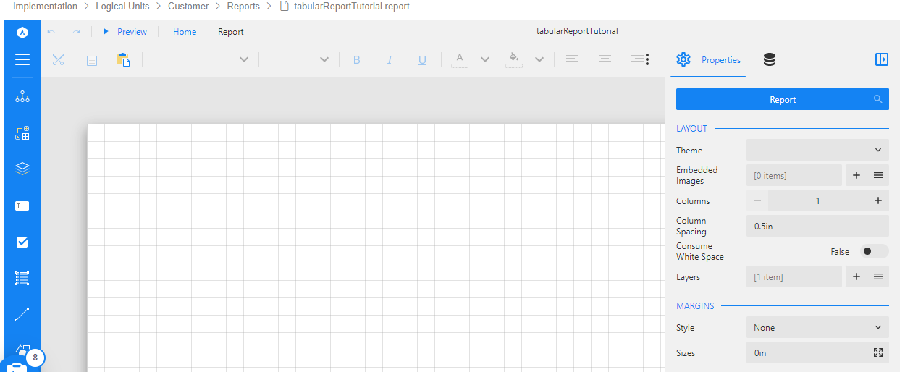
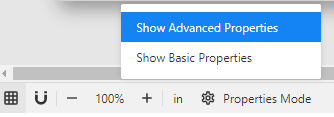

<web>

# Report Designer

### Overview

The report creation is performed using the **Designer** component, which is embedded into the Fabric Studio. The report creation process comprises of the following steps:

1. Define a data source and data set(s) in an empty report canvas. 
2. Validate the data set(s) and define the input parameter(s).
3. Create the report layout and bind the report elements to the data set's fields. 
4. Design the report's layout: fonts, colors, borders, etc.

This article describes how to initiate a new report creation and the following articles in this user guide explain about the additional steps.

### New Report

To initiate a new report creation, go to the Logical Unit in the project tree, right-click on **Reports > New Report** and populate the report name. Click **Enter** to create and open an empty report canvas. The report is created with a continuous page layout, which means that a data region (such as a table) would grow until there is no more space on the current page and then another page would be produced. 

Now, click anywhere on the gray area surrounding the report in order to load the report's properties in the **Properties Panel**. Here you can set various report level properties, such as margins style and size.

Note that you can control the Properties mode - Basic or Advanced - via the settings icon located at the bottom of the page:

 

</web>
