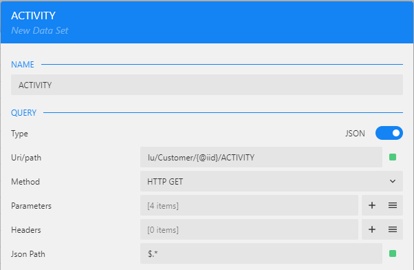
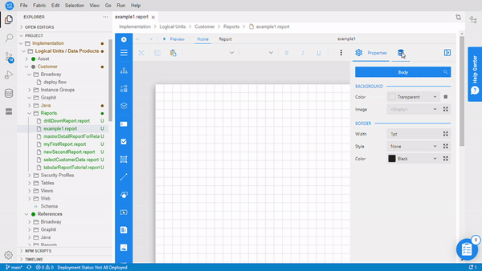

<web>

# Data Binding

Data binding is a technique that establishes a connection between a report and the displayed data, starting with the addition of a data source and one or more data sets.

### Data Source Configuration

To create a data source, click the icon in the **Data Sources** area of the report's properties. It provides a choice of 2 templates:

- The **fabric_api** data source is defined as the **/api/** Fabric endpoint that runs under your Fabric's host. This is a default data source to be used for any Fabric API (built-in or custom).

- The **custom data source** is an empty template that allows to define any required endpoint, by setting the following properties:

  - **Endpoint** - either a full-path or a base URL of your REST API. Then the endpoint paths are appended by using data sets (described later on in this article).

  - **HTTP Headers** - a collection of HTTP Header fields that are passed with the request. 

  - **Query Parameters** - a collection of name/value pairs that define the Query String of the URL.

### Data Set Configuration

Each data source may contain one or more data sets. To create a data set, click the icon near the data source name in the **Data Sources** area of the report's properties. It provides a choice of several Fabric endpoint templates and a custom data set definition. 

**Data Set Based on Fabric Endpoints** 

The Fabric endpoints include the following templates:

* **luTable**, defined by ```lu/{luName}/{@iid}/{table}``` Fabric endpoint.
* **luQuery**, defined by ```lu/Customer/{@iid}``` Fabric endpoint.
* **commonTable**, defined by ```common/{table}``` Fabric endpoint.
* **command_get**, defined by ```fabric-command``` Fabric endpoint.

Once selecting one of the above templates, a New Data Set window opens with a pre-defined **Uri/path** and **Parameters** that correspond to the selected template, as per the following logic:

* The ```{luName}``` of the Fabric endpoint is pre-populated with the name of Logical Unit under which the report is created. 
* The ```{table}``` is pre-populated with the TABLE_NAME constant and should be updated to the required LU Table name. 
* The **Uri/path** of the Fabric Endpoint templates includes a parameter ```iid```, which hasn't yet been defined for this report. [Click here to learn how to define a new parameter](04_parameters_creation.md) or follow the steps of this user guide until you reach the step of parameters definition.

It is recommended to update the default data set name to a meaningful and a suitable name, for example:



There is a quick way to creation a data binding with Fabric built-in endpoints. [Click here to get more details on how to do it.](05_quick_data_binding_with_Fabric.md)

**Custom Data Set Definition**

The **custom data set** allows to define any required endpoint, by setting the following properties:

* **Uri/path** - the value depends on the configuration of the parent data source. If the data source's endpoint is a full-path URL, the data set's Uri/path should be empty. If, however, the data source's endpoint is a base URL, then the data set's Uri/path should contain the full-path URL of the data endpoint.
* **Method** - specifies the request method. The supported methods are GET and POST.
* **Parameters** and **Headers** - name/value pairs that define the URL’s Query String and HTTP Header fields that are passed with the request (similar to the **Query Parameters** and **HTTP Headers** properties of the data source).
* **Json Path** - JSON data endpoints can retrieve the data of various shapes, and there is no standardized data structure. Hence, it is required to specify the structure using the [JSONPath expression](https://goessner.net/articles/JsonPath/). You can use `$.*` or `$[*]` JSONPath expression to specify the repeated data fragments.

**Note**: The templates for Data Source and Data Set creations are available for new reports only. When adding a data source or a data set to an existing report, New Data Source and New Data Set windows will open, requiring a manual population of all details. 

### Data Set Validation

For completion of its creation, a Data Set must be validated. The validation is done in order to check that everything is defined correctly and to retrieve the fields list. 

1. Click on the **Validate** button (bottom left corner of *New Data Set* window) to validate the data set. Note that prior to the validation, the number of fields is 0.

   

2. When the **Uri/path** includes a parameter, you will be prompted to insert the parameter value: 

    

3. Populate a valid parameter value and click **Save & Run** to run the validation.

    * If the validation succeeded, the fields are populated. You can click the  icon in the **Database Fields** section to expand the list of fields.

    * If the configuration is invalid or if there are other issues relating to data connection, the dialog box displays an error message at the top area of the Data Set window.

      

4. The fields can be updated as follows:

    * The default names of the **Database Fields** can be updated.
    * You can specify the field's data type, which is useful mostly for tagging Date fields because, in JSON data format, dates are usually represented by strings. Add **[Date]** tag to the Date fields to tag a field and then set the format using the cell properties.

    * In addition to Database Fields, you can define **Calculated Fields** to be added to the data set by using an expression. 

      

5. Click on the **Save Changes** button to finalize the Data Set definition.

### Example

The below example demonstrates how to define a data source and a data set using Fabric endpoint templates:




Proceed to the next step of this user guide to define the report's parameters.

[Click for more details about data binding options in ActiveReportsJS.](https://www.grapecity.com/activereportsjs/docs/ReportAuthorGuide/Databinding)


[](02_create_new_report.md)[](04_parameters_creation.md)

</web>
