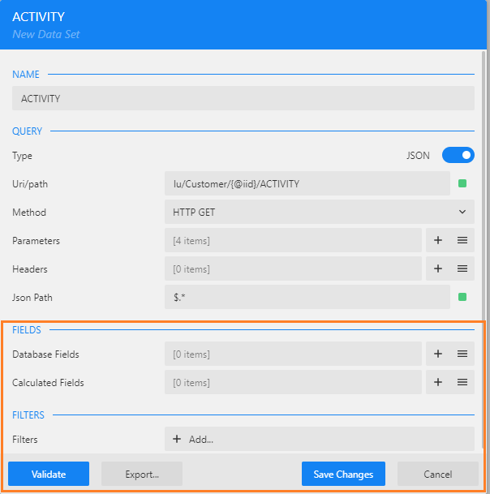
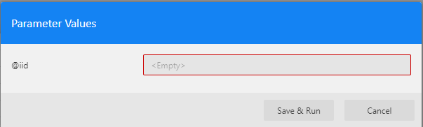
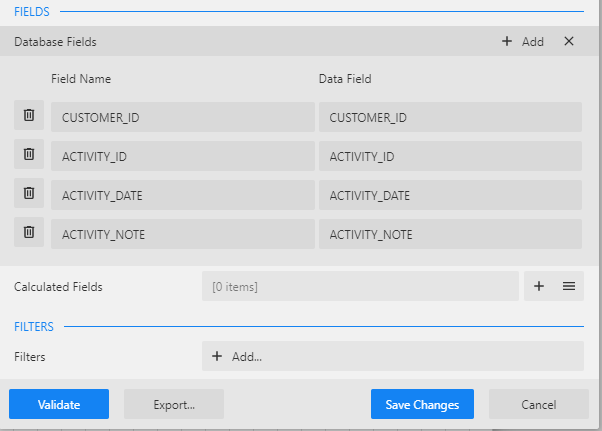
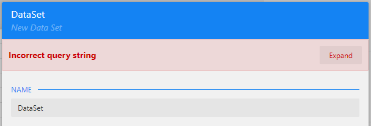
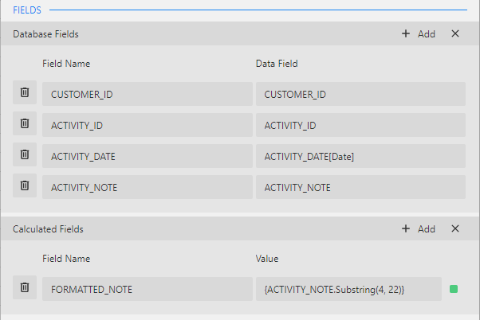

# Data Set Validation

Once you create a data source and a data set, the next step is to validate the data set. The validation is done in order to check that everything is defined correctly and to retrieve the fields list. 

If you haven't yet created a data source and a data set, follow the steps described [in the previous article](02_create_new_report.md) to do so.

### How Do I Validate a Data Set?

1. Click **Validate** button to validate the data set. Note that prior to the validation, the number of fields is 0.

   

2. When **Uri/path** includes a parameter, you will be prompted to insert the parameter value: 

3. Populate a valid parameter value and click **Save & Run**. Then the validation is executed.

    * If the validation has passed successfully, the fields are populated. You can click the  icon in the **Database Fields** section to expand the list of fields.

      

    * If the configuration is invalid, or there are other issues with a data connection, the dialog shows an error message at the top area of the Data Set window.

      

4. You can define Calculated Fields to be added to the data set. For example, if there are FIRST_NAME and LAST_NAME fields in the list of Database Fields, they can be concatenated into a new calculated field - CUSTOMER_NAME.

    

5. Click the **Save Changes** button to finalize the Data Set definition.

Proceed to the next step of this user guide to define the report's parameters.

